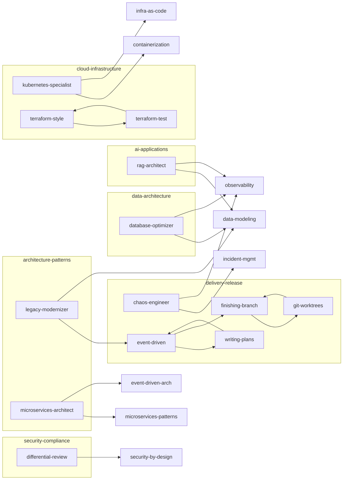

# Skill Normalization Report

**Date**: 2026-02-14
**Skills audited**: 58
**Skills modified**: 27
**Skills already at standard**: 31

## Golden Standard

Derived from: observability, api-design, data-modeling

Key quality indicators:
- Dense operational tone — every sentence is an instruction or constraint
- TypeScript code examples with realistic variable names and type annotations
- Decision tables for choosing between approaches
- Specific numbers, not vague guidance
- WHY before HOW in every section
- Anti-Patterns with consequences, not just prohibitions
- For Claude Code as dense imperative paragraph

## Changes Summary

| Skill | Priority | Gaps Found | Changes |
|-------|----------|-----------|---------|
| legacy-modernizer | CRITICAL | 6 | Full rewrite: Purpose, 5 core sections with code, Anti-Patterns, For Claude Code, internal refs |
| microservices-architect | CRITICAL | 6 | Full rewrite: Purpose, 5 core sections with gRPC/saga code, Anti-Patterns, For Claude Code, internal refs |
| chaos-engineer | CRITICAL | 5 | Full rewrite: Purpose, 5 core sections with YAML/CI examples, Anti-Patterns, For Claude Code, internal refs |
| database-optimizer | CRITICAL | 5 | Full rewrite: Purpose, 5 core sections with SQL/TypeScript, Anti-Patterns, For Claude Code, internal refs |
| kubernetes-specialist | CRITICAL | 5 | Added Anti-Patterns section (7 items) |
| rag-architect | CRITICAL | 5 | Full rewrite: Purpose, 5 core sections with TypeScript, Anti-Patterns, For Claude Code, internal refs |
| differential-review | MODERATE | 3 | Added Anti-Patterns (6), For Claude Code, internal refs |
| terraform-style-guide | MODERATE | 3 | Added Purpose, Anti-Patterns (6), For Claude Code, internal refs |
| terraform-test | MODERATE | 3 | Added Anti-Patterns (6), For Claude Code, internal refs; cleaned frontmatter |
| using-git-worktrees | MODERATE | 2 | Expanded Anti-Patterns (5 with consequences), added For Claude Code |
| ask-questions-if-underspecified | MODERATE | 1 | Added For Claude Code |
| verification-before-completion | MODERATE | 1 | Added For Claude Code |
| writing-plans | MODERATE | 1 | Added For Claude Code |
| executing-plans | MODERATE | 1 | Added For Claude Code |
| finishing-a-development-branch | MODERATE | 1 | Added For Claude Code |
| authn-authz | MINOR | 1 | Added Anti-Patterns (6) |
| cicd-pipeline | MINOR | 1 | Added Anti-Patterns (6) |
| apple-compliance-audit | MINOR | 1 | Added Anti-Patterns (5) |
| diagrams | MINOR | 1 | Added Anti-Patterns (5) |
| ios-app-audit | MINOR | 1 | Added Anti-Patterns (5) |
| ios-gui-assessment | MINOR | 1 | Added Anti-Patterns (5) |
| owasp-security | MINOR | 1 | Added Anti-Patterns (5) |
| property-based-testing | MINOR | 1 | Added Anti-Patterns (5) |
| pypict-claude-skill | MINOR | 1 | Added Anti-Patterns (5) |
| security-by-design | MINOR | 1 | Added Anti-Patterns (6) |
| sharp-edges | MINOR | 1 | Added Anti-Patterns (5) |
| testing-implementation | MINOR | 1 | Added Anti-Patterns (5) |

## Cross-Reference Graph

(Note: Create a Mermaid graph showing skill interconnections. Group by cluster. Show only the skills that were modified, with edges for their internal references.)

## Remaining Issues

- **property-based-testing**: missing For Claude Code section and internal references — low priority, skill is process-oriented
- **owasp-security**: missing For Claude Code section — has extensive language-specific guidance that serves similar purpose
- Some bidirectional reference gaps may exist — Phase 2 cross-reference check will identify and fix

## Statistics

- Total gap fixes applied: 52
- Anti-Patterns sections added: 24
- For Claude Code sections added: 14
- Internal references added/fixed: 8
- Full structural rewrites: 5
- Version bumps: 27
