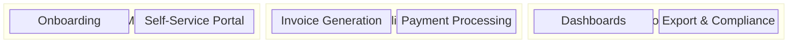
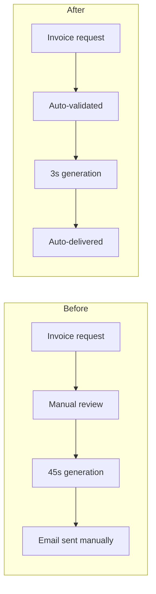
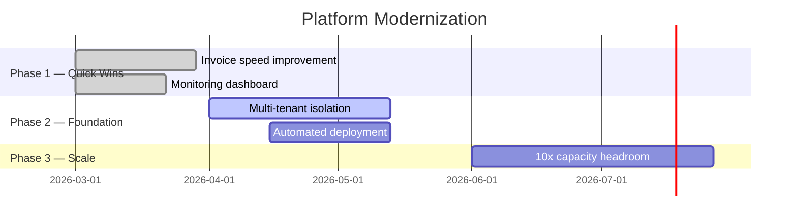
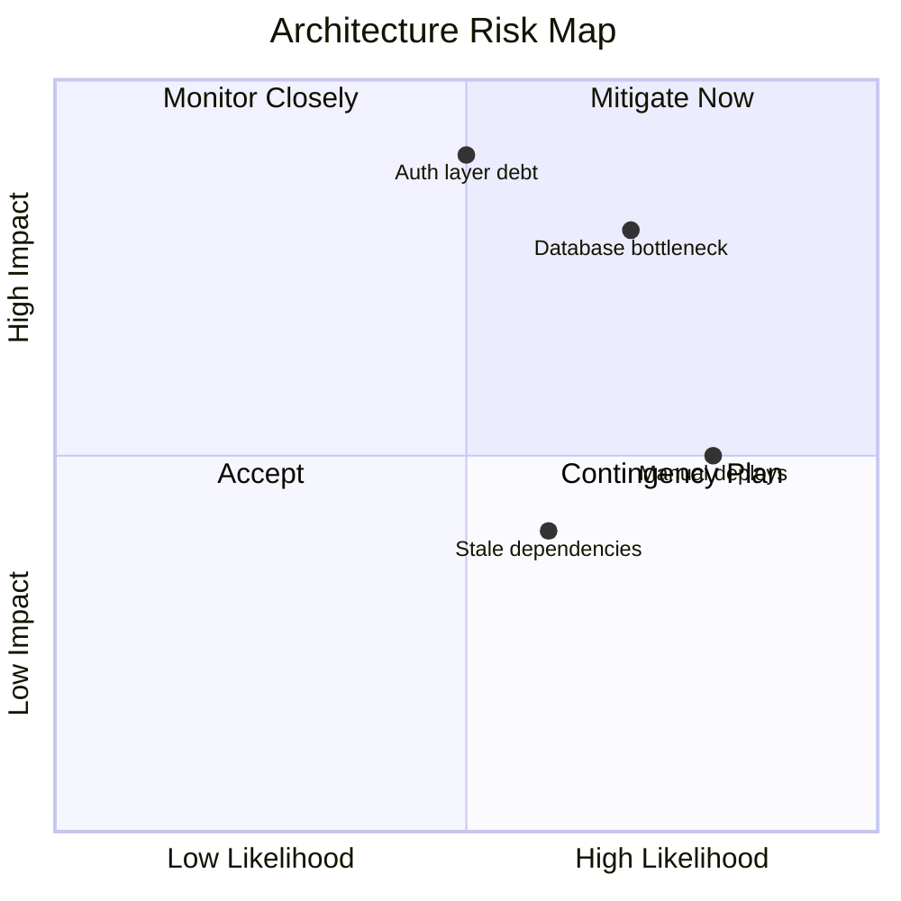

# Architecture Stakeholder Communication

> **Version**: 1.0.0 | **Last updated**: 2026-02-14

## Purpose

Architecture that isn't communicated doesn't exist. This skill covers strategic communication: pitching architectural investments, explaining technical risk in business terms, and building alignment across organizational boundaries. It is the Architect Elevator's core skill -- translating between the penthouse (executives thinking in business outcomes) and the engine room (engineers thinking in systems).

---

## Audience Mapping

Every communication starts with the audience. Frame the same decision differently depending on who is listening.

| Audience | They care about | Frame as | Avoid |
|----------|----------------|----------|-------|
| **CTO / VP Engineering** | Technical risk, team velocity, platform longevity | Architectural trade-offs with timeline and risk impact | Oversimplification -- they detect it and lose trust |
| **CFO / Finance** | Cost, ROI, predictability, unit economics | Investment with measurable return and cost of delay | Technical jargon, open-ended budgets, "it depends" |
| **Product Management** | Feature velocity, user impact, time to market | Enabler of product capabilities, faster iteration | Infrastructure details, component names, protocol choices |
| **Engineering Teams** | Implementation clarity, scope, migration burden | Concrete changes to their code, tools, and workflows | Abstract strategy without actionable next steps |
| **External Stakeholders** | Reliability, security, compliance, SLA | Contractual guarantees, audit evidence, certifications | Internal implementation details, org structure |

Rule: if you use a word the audience wouldn't use in their own documents, replace it.

---

## Architecture Brief Template (Executive 1-Pager)

Use this template for any architectural investment that requires leadership approval.

```markdown
# Architecture Brief: [Title]

**Author**: [Name] | **Date**: [Date] | **Status**: Draft / Under Review / Approved

## Situation
[2-3 sentences. What is happening today? What business process is affected?]

## Impact
[Business terms only. Revenue at risk, customers affected, velocity lost, compliance exposure.]

## Proposal
[What we will do, in language a non-engineer can read. No component names, no protocols.]

## What Changes

| For whom | What changes | Timeline |
|----------|-------------|----------|
| [Users / Team / Ops] | [Observable change] | [Phase / Date] |
| ... | ... | ... |

## Investment
- **Effort**: [person-weeks or story points]
- **Duration**: [calendar time]
- **Trade-off**: [what we defer or accept to do this]

## Risk of Inaction
[What happens if we do nothing. Quantify: cost, incidents, lost customers, compliance fines.]

## Success Metrics
- [Metric 1 — measurable, time-bound]
- [Metric 2]
```

Never submit a brief longer than one page. If it requires more, the proposal hasn't been synthesized enough.

---

## The Architecture Pitch

Six-step structure inspired by Hohpe's Architect Elevator. Use when presenting to leadership or cross-functional groups.

**Step 1 -- The Pain.** Start with business pain, not technical debt. "Our customers wait 45 seconds for invoice generation" not "our monolith has coupling issues." If the audience doesn't feel the pain, they won't fund the cure.

**Step 2 -- The Root Cause (Simplified).** One sentence explaining why this happens. Use analogy if needed: "Our system processes invoices through a single door -- when traffic increases, everyone queues." No architecture diagrams yet.

**Step 3 -- The Vision.** Describe business capabilities enabled, not technical components deployed. "Invoices generated in under 3 seconds, even at 10x current volume" not "event-driven microservices with CQRS."

**Step 4 -- The Path.** Phased delivery. Quick wins first to build credibility. Each phase delivers measurable business value, not intermediate technical milestones. "Phase 1 (4 weeks): invoice generation drops to 5 seconds. Phase 2 (6 weeks): under 3 seconds with 10x headroom."

**Step 5 -- The Ask.** Be explicit about the decision needed and the resources required. "We need 2 engineers for 10 weeks and approval to defer Feature X by 3 weeks." Never leave the ask implicit.

**Step 6 -- The Alternative (Cost of Inaction).** Quantify what happens if nothing changes. "At current growth rate, invoice generation exceeds 2 minutes by Q3, triggering SLA violations on 3 enterprise contracts worth $240K ARR."

---

## Technical Risk Communication

Technical risks are invisible to non-technical stakeholders until they materialize as outages, delays, or cost overruns. Translate preemptively.

| Technical Risk | Business Translation | Executive-Ready Phrasing |
|---------------|---------------------|--------------------------|
| Database scaling bottleneck | Invoice processing slows as customer count grows | "At current growth, invoice processing exceeds our SLA by Q3" |
| No circuit breakers | One failing integration takes down unrelated features | "A payment provider outage would also prevent invoice creation and reporting" |
| Monolithic deployment | Every change requires full system release, increasing risk | "Bug fixes take 2 weeks instead of 2 hours because every change ships with everything else" |
| No multi-tenancy isolation | One customer's load impacts all customers | "A large customer's month-end batch could slow the platform for everyone" |
| Hardcoded configuration | Environment changes require code changes and redeployment | "Changing a business rule requires an engineering release cycle instead of a configuration update" |
| Missing observability | Outages discovered by customers, not by us | "We learn about problems from customer complaints, not from our own monitoring" |
| Outdated dependencies | Known security vulnerabilities in production | "We're running software with publicly known security holes that attackers can exploit" |
| No disaster recovery plan | Unquantified recovery time after major failure | "If our primary system fails, we don't know how long it takes to restore service" |
| Shared database across services | Changes to one feature risk breaking unrelated features | "Updating the billing logic could accidentally break the reporting dashboard" |
| No capacity planning | Unknown breaking point under load | "We don't know how many concurrent users we can handle before the system degrades" |
| Manual deployment process | Error-prone, slow, unrepeatable releases | "Every release depends on one engineer following 47 manual steps correctly" |
| Technical debt in auth layer | Security incident surface grows with each workaround | "Each shortcut we take in login security makes a future breach more likely and more damaging" |

Pattern: **[current state]** causes **[business consequence]** which means **[impact in their language]**.

---

## Architecture Visualization for Non-Technical Audiences

C4 diagrams are for engineers. For non-technical stakeholders, use simplified visual formats.

### Capability Map

Shows what the system does, not how. Business capabilities grouped by domain.



### Before / After View

Shows what changes for the user or business process. No technical components.



### Timeline View (Phased Rollout)

Shows what stakeholders get and when.



### Risk Heatmap

Shows where risk concentrates. Use color to indicate severity.



---

## Communication Cadence

Architecture communication is not a one-time event. Establish rhythm.

| Cadence | Audience | Format | Content |
|---------|----------|--------|---------|
| **Monthly** | Engineering leadership | Architecture Brief (1-pager) | Active initiatives, risks, decisions needed |
| **Quarterly** | CTO + Product leads | Architecture Review (45 min) | Strategic alignment, roadmap impact, investment priorities |
| **Per-decision** | Affected teams | ADR + async review | Decision rationale, impact, migration path |
| **Within 48h of decision** | All affected parties | Written communication | What was decided, why, what changes for them, timeline |
| **Optional: biweekly** | Engineering org | Architecture Newsletter | Patterns adopted, lessons learned, upcoming changes |

Post-decision communication is non-negotiable. A decision that isn't communicated within 48 hours will be re-litigated. Include: the decision, the rationale (link to ADR), what changes for each team, and the timeline.

---

## Measuring Communication Effectiveness

Communication that doesn't change behavior is noise. Track leading indicators:

- **Decision adoption rate**: percentage of teams correctly implementing architectural decisions without follow-up clarification
- **Proactive consultation**: stakeholders initiate architecture discussions before making conflicting decisions, not after
- **Reduced re-litigation**: "why was this decided?" questions decrease over time -- a sign that communication reached the right people
- **Architecture alignment in reviews**: code reviews and design documents reference ADRs and architectural principles without prompting
- **Time to alignment**: elapsed time from proposal to organizational buy-in decreases quarter over quarter

If you consistently hear "I didn't know about that decision" from affected teams, the cadence or channel is broken. Fix the distribution, not the content.

---

## Anti-Patterns

- **Architecture astronaut pitch**: presenting a technically beautiful solution in technical language that nobody in the room understands or can evaluate -- translate to business outcomes or stay in the engine room
- **The Big Reveal**: presenting a fully-formed architecture for "approval" with no prior socialization -- stakeholders rubber-stamp or reject; neither produces good architecture
- **Death by diagram**: showing 8 C4 diagrams to a CFO who needs one number and one risk statement -- match visual complexity to audience technical depth
- **Jargon as credibility**: using technical terms to signal expertise rather than to communicate -- if the audience nods without understanding, you've failed
- **Cost-of-inaction omission**: pitching what the investment buys without quantifying what inaction costs -- executives compare against "do nothing," so make that comparison explicit
- **One-size-fits-all communication**: sending the same architecture document to engineers, product managers, and executives -- each audience needs a different frame, level of detail, and call to action
- **Fire-and-forget decisions**: making an architectural decision and assuming it propagates -- decisions not communicated within 48 hours get re-litigated or ignored

---

## For Claude Code

When generating architecture communication artifacts: always identify the target audience before choosing format and detail level. For executive audiences, produce the Architecture Brief template with zero technical jargon -- replace every technical term with its business equivalent using the translation table. For architecture pitches, follow the six-step Hohpe structure starting with business pain. Generate simplified Mermaid visualizations (capability maps, before/after, timeline, risk heatmaps) for non-technical audiences instead of C4 diagrams. Include risk-of-inaction quantification in every proposal. When producing ADR communication, generate per-audience summaries: technical detail for engineers, timeline and team impact for managers, cost and risk for executives. Never generate a proposal without a "What changes" table mapping audience to observable change to timeline.

---

*Internal references*: `architecture-communication/SKILL.md`, `architecture-decision-records/SKILL.md`
