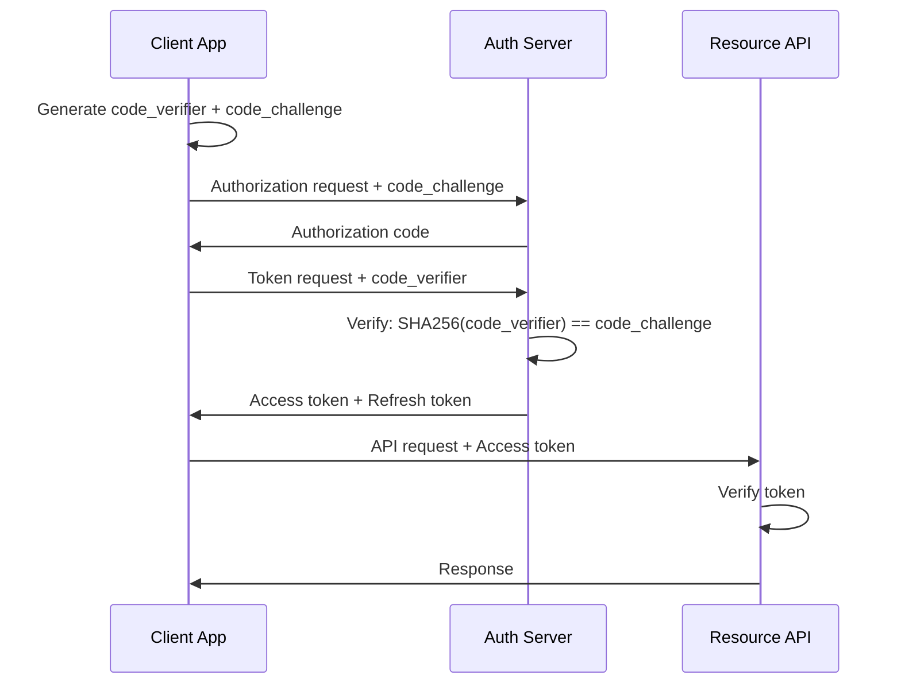

# Authentication & Authorization

> **Version**: 1.2.0 | **Last updated**: 2026-02-09

## Purpose

Patterns for authentication and authorization in multi-tenant context. Firebase Auth as identity provider, JWT for tokens, RBAC/ABAC for permissions.

---

## Authentication (who you are)

### Firebase Auth

Firebase Auth as default identity provider. Supports: email/password, Google Sign-In, Apple Sign-In, OIDC/SAML for enterprise SSO. Advantages: zero infrastructure to manage, client SDKs for web and iOS, integrated with Firestore security rules.

### JWT Token Flow

Firebase Auth issues JWT (ID token) that the client sends as `Authorization: Bearer <token>` on every API request. Backend validates the token with Firebase Admin SDK (verifies signature, expiration, issuer).

Custom claims in JWT for role and tenant: `{ tenantId: "t_abc", role: "admin" }`. Custom claims are set server-side and propagated on next token refresh.

```typescript
async function authMiddleware(req: Request, res: Response, next: NextFunction) {
  const token = req.headers.authorization?.replace('Bearer ', '');
  if (!token) return res.status(401).json({ error: 'Missing token' });
  try {
    const decoded = await firebaseAdmin.auth().verifyIdToken(token);
    req.auth = { uid: decoded.uid, tenantId: decoded.tenantId, role: decoded.role };
    next();
  } catch {
    return res.status(401).json({ error: 'Invalid token' });
  }
}
```

### OAuth2 PKCE Flow (for public clients)



PKCE (Proof Key for Code Exchange) prevents authorization code interception attacks. Required for all public clients (SPAs, mobile apps). The code_verifier is never sent over the network until the token exchange step.

### Token Revocation

When a user logs out, changes password, or is suspended:

```typescript
// Revoke all refresh tokens for a user
await firebaseAdmin.auth().revokeRefreshTokens(userId);

// In middleware: verify token was issued after last revocation
const decodedToken = await firebaseAdmin.auth().verifyIdToken(token, true); // checkRevoked = true
```

Note: Firebase ID tokens have a **1-hour lifetime** (not configurable). The `checkRevoked` flag adds a round-trip to Firebase but is essential for security-sensitive operations (admin actions, payment flows). For regular endpoints, accept the 1-hour window and rely on refresh token revocation.

### Refresh Token Rotation

Rotate refresh tokens on every use to limit the window of a stolen token:

```typescript
// On token refresh: issue new refresh token, invalidate old
async function rotateRefreshToken(oldRefreshToken: string): Promise<TokenPair> {
  const decoded = await verifyRefreshToken(oldRefreshToken);
  await invalidateRefreshToken(oldRefreshToken); // one-time use
  const newTokens = await issueTokenPair(decoded.uid);
  return newTokens;
}
```

### Session Management

Token lifetime: ID token 1 hour (Firebase default, not modifiable), refresh token long-lived. Revocation: Firebase supports refresh token revocation (immediate user block). Backend must verify `auth_time` to detect tokens issued before revocation. For non-Firebase setups: access token 15 minutes, refresh token 7 days with rotation.

---

## Authorization (what you can do)

### RBAC (Role-Based Access Control)

Default for applications with well-defined roles. Typical roles: `owner` (full tenant access), `admin` (user and config management), `editor` (business data CRUD), `viewer` (read-only). Roles are hierarchical: owner > admin > editor > viewer.

#### Permission Middleware

```typescript
const ROLE_HIERARCHY: Record<string, number> = { viewer: 1, editor: 2, admin: 3, owner: 4 };

function requireRole(minimumRole: string) {
  return (req: Request, res: Response, next: NextFunction) => {
    const userLevel = ROLE_HIERARCHY[req.auth.role] ?? 0;
    const requiredLevel = ROLE_HIERARCHY[minimumRole] ?? Infinity;
    if (userLevel < requiredLevel) {
      return res.status(403).json({ error: `Requires ${minimumRole} role` });
    }
    next();
  };
}

// Usage in routes
router.get('/invoices', authMiddleware, tenantGuard, requireRole('viewer'), listInvoices);
router.post('/invoices', authMiddleware, tenantGuard, requireRole('editor'), createInvoice);
router.delete('/users/:id', authMiddleware, tenantGuard, requireRole('admin'), deleteUser);
```

### ABAC (Attribute-Based Access Control)

When RBAC isn't enough: permissions based on user, resource, and context attributes. Example: "an editor can modify only invoices they created" or "a user can access only their department's data." More flexible but more complex. Use only when pure RBAC is insufficient.

### Multi-Tenant Authorization

Fundamental rule: the tenant_id in the JWT token must match the tenant_id of the requested resource. This check is in middleware, before any business logic.

```typescript
function tenantGuard(req: Request, res: Response, next: NextFunction) {
  const tokenTenantId = req.auth.tenantId;
  const resourceTenantId = req.params.tenantId;
  if (tokenTenantId !== resourceTenantId) {
    return res.status(403).json({ error: 'Tenant mismatch' });
  }
  next();
}
```

No exceptions. No "super admin" bypassing tenant checks on normal APIs. Cross-tenant operations live in separate APIs with dedicated authorization.

---

## API Key Authentication

For server-to-server integrations where OAuth is impractical. API keys are **not** a substitute for user authentication.

```typescript
// API key middleware — for external integrations only
async function apiKeyAuth(req: Request, res: Response, next: NextFunction) {
  const apiKey = req.headers['x-api-key'];
  if (!apiKey) return res.status(401).json({ error: 'Missing API key' });

  const keyRecord = await apiKeyStore.findByHash(hashApiKey(apiKey as string));
  if (!keyRecord || keyRecord.revokedAt) {
    return res.status(401).json({ error: 'Invalid API key' });
  }

  // Scope check: API keys have limited permissions
  req.auth = { tenantId: keyRecord.tenantId, scopes: keyRecord.scopes, type: 'api-key' };
  next();
}
```

**Rules**: hash API keys before storing (never store plaintext), include tenant scope, set expiration, support rotation (overlapping validity windows), log all usage for audit.

---

## Multi-Factor Authentication (MFA)

MFA required for: admin roles, operations affecting billing or user management, and first login from a new device. Firebase Auth supports TOTP and SMS as second factors. Prefer TOTP (authenticator apps) over SMS (SIM-swap vulnerable).

**Passkeys / WebAuthn**: preferred for new implementations. Phishing-resistant, no shared secrets. Firebase Auth supports passkeys. For custom backends, use `@simplewebauthn/server`. Passkeys eliminate passwords entirely — consider as the primary auth method for new projects.

---

## Service-to-Service Auth

Between microservices: IAM-based on Cloud Run (calling service has `roles/run.invoker`). Token issued automatically by GCP metadata server. No shared secrets, no hardcoded API keys.

For external services: API keys with rotation, scoped to minimum necessary permissions.

---

## For Claude Code

When generating endpoints: auth middleware on every route (never leave an endpoint without auth, not even for testing), tenant guard for multi-tenant resources, role check with `requireRole()` middleware. Generate tests for: access without token (401), access to different tenant (403), access with insufficient role (403), authorized access (200). For API key endpoints: validate scopes, log usage. For admin endpoints: consider requiring MFA verification.

---

*Internal references*: `security-by-design/SKILL.md`, `api-design/SKILL.md`, `compliance-privacy/SKILL.md`
