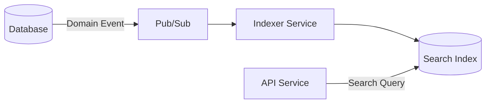

# Caching & Search

> **Version**: 1.2.0 | **Last updated**: 2026-02-09

## Purpose

Patterns for distributed caching and full-text search. When to introduce them, how to manage them, how to invalidate them.

---

## Caching

### When to Introduce Cache

Cache is added complexity (invalidation, stale data, harder debugging). Introduce only when: there's a measured bottleneck (latency or query cost), the data is read much more than written (read/write ratio > 10:1), stale data tolerance is acceptable for the use case.

### Patterns

**Cache-Aside (Lazy Loading)**: application code manages the cache. Read: check cache -> miss -> query DB -> write cache. Write: write DB -> invalidate cache. Default for most cases.

**Write-Through**: code writes to both cache and DB. Cache is always up-to-date. Write overhead. Use when cache-DB consistency is critical.

**Write-Behind (Write-Back)**: code writes to cache, cache writes to DB async. Maximum write performance, risk of data loss if cache crashes. Use only for loss-tolerant data (analytics, non-critical counters).

### Cache Key Design

```
<namespace>:<version>:<entity>:<tenant>:<identifier>

Examples:
  app:v1:invoice:t_abc123:inv_456     # Single entity
  app:v1:invoices:t_abc123:list:page1 # Collection page
  app:v1:config:t_abc123:features     # Tenant config
```

**Rules**:
- Always include tenant ID in cache key (multi-tenant isolation)
- Include version prefix to invalidate all keys on schema change
- Use colons as separators (Redis convention)
- Keep keys readable for debugging

### GCP Implementation — Redis (Memorystore)

```typescript
import { createClient } from 'redis';

const redis = createClient({ url: process.env.REDIS_URL });

async function getCachedInvoice(tenantId: string, invoiceId: string): Promise<Invoice | null> {
  const key = `app:v1:invoice:${tenantId}:${invoiceId}`;
  const cached = await redis.get(key);
  if (cached) return JSON.parse(cached);

  const invoice = await invoiceRepository.findById(tenantId, invoiceId);
  if (invoice) {
    await redis.set(key, JSON.stringify(invoice), { EX: 300 }); // 5 min TTL
  }
  return invoice;
}

async function invalidateInvoiceCache(tenantId: string, invoiceId: string): Promise<void> {
  await redis.del(`app:v1:invoice:${tenantId}:${invoiceId}`);
  // Also invalidate list caches for this tenant
  // NEVER use redis.keys() in production — it blocks the entire Redis instance
  for await (const key of redis.scanIterator({ MATCH: `app:v1:invoices:${tenantId}:list:*`, COUNT: 100 })) {
    await redis.del(key);
  }
}
```

**In-memory (process)**: LRU Map for L1 local cache. For immutable or near-immutable data (configurations, feature flags). No additional infrastructure cost.

**Cloud CDN**: for cacheable HTTP responses. `Cache-Control: public, max-age=3600` for static resources. `Cache-Control: private, max-age=60` for user-specific API data.

### Invalidation

The hardest caching problem. Strategies: TTL-based (data expires after N seconds — simple, stale-tolerant), event-based (when a domain event indicates data changed, invalidate cache — more precise, more complex), version-based (data has a version, cache checks if version is current).

Rule: use TTL as baseline (every cache entry has a TTL), add active invalidation only where stale tolerance is low.

### Cache Warming

For data that must be available immediately (no cold-start latency):

```typescript
// On service startup, preload frequently accessed data
async function warmCache(): Promise<void> {
  const activeTenants = await tenantRepository.getActive();
  for (const tenant of activeTenants) {
    const config = await configService.getTenantConfig(tenant.id);
    await redis.set(`app:v1:config:${tenant.id}:features`, JSON.stringify(config), { EX: 3600 });
  }
  logger.info({ tenantsWarmed: activeTenants.length }, 'Cache warming complete');
}
```

### Cache Stampede Prevention

When a popular cache key expires, many concurrent requests hit the database simultaneously (thundering herd). Use the singleflight pattern:

```typescript
import { Mutex } from 'async-mutex';

const locks = new Map<string, Mutex>();

async function getCachedWithSingleflight<T>(
  key: string,
  fetchFn: () => Promise<T>,
  ttl: number,
): Promise<T> {
  const cached = await redis.get(key);
  if (cached) return JSON.parse(cached);

  // Only one request fetches; others wait for the result
  const mutex = locks.get(key) ?? new Mutex();
  locks.set(key, mutex);

  return mutex.runExclusive(async () => {
    // Double-check after acquiring lock
    const rechecked = await redis.get(key);
    if (rechecked) return JSON.parse(rechecked);

    const result = await fetchFn();
    await redis.set(key, JSON.stringify(result), { EX: ttl });
    locks.delete(key);
    return result;
  });
}
```

Alternative: use stale-while-revalidate — serve stale data immediately while refreshing in the background.

### Redis Cluster & Sentinel

**Redis Sentinel**: for high availability (automatic failover). Suitable for single-master setups with < 100GB data.

**Redis Cluster**: for horizontal scaling. Data sharded across nodes. Required when data exceeds single-node memory. Note: multi-key operations (MGET, pipeline) must target the same hash slot — design cache keys accordingly.

For GCP: Memorystore for Redis supports both standard (Sentinel-like HA) and cluster modes.

### CDN Invalidation Patterns

For cached HTTP responses behind Cloud CDN:

- **Tag-based invalidation**: tag responses by resource type, invalidate by tag on writes
- **Surrogate keys**: `Surrogate-Key: tenant-{id} invoices` header, purge by key
- **TTL + event-based**: short TTL (60s) for dynamic content, event-driven purge for immediate consistency

Rule: CDN is for read-heavy, tolerance-for-staleness content (product pages, public APIs). Never CDN user-specific authenticated responses.

### Monitoring Cache Health

Essential metrics for cache observability:

| Metric | Target | Action if Below |
|--------|--------|-----------------|
| Hit rate | > 80% | Review access patterns, adjust TTL |
| Miss rate | < 20% | Consider warming, check key design |
| Latency (p95) | < 5ms | Check network, Redis memory pressure |
| Eviction rate | Low | Increase memory or reduce TTL |
| Memory usage | < 80% | Scale up or reduce cached data |

---

## Search

### When You Need a Search Engine

When database queries aren't enough: full-text search with relevance ranking, fuzzy matching and typo tolerance, faceted search (filter by category, price, date), search across unstructured documents.

### GCP Options

**Firestore query**: sufficient for simple filters and exact field search. Does not support full-text search.

**Cloud SQL (PostgreSQL) full-text search**: `tsvector` + `tsquery` for full-text search integrated in the relational database. Good compromise for moderate volume (< 10M documents). No additional infrastructure.

**Elasticsearch / OpenSearch**: for advanced search, high volume, custom scoring. Separate infrastructure. Use only when PostgreSQL FTS isn't enough.

**Typesense / Meilisearch**: lightweight, developer-friendly alternatives to Elasticsearch. Simpler to operate, less flexible. Good choice for product catalog search, documentation search.

### PostgreSQL Full-Text Search Example

```sql
-- Add search column and index
ALTER TABLE invoices ADD COLUMN search_vector tsvector;

CREATE INDEX idx_invoices_search ON invoices USING GIN(search_vector);

-- Update search vector (trigger or application code)
UPDATE invoices SET search_vector =
  setweight(to_tsvector('english', coalesce(customer_name, '')), 'A') ||
  setweight(to_tsvector('english', coalesce(description, '')), 'B') ||
  setweight(to_tsvector('english', coalesce(invoice_number, '')), 'A');

-- Search with ranking
SELECT id, customer_name, description,
       ts_rank(search_vector, query) AS rank
FROM invoices,
     to_tsquery('english', 'acme & consulting') AS query
WHERE tenant_id = $1
  AND search_vector @@ query
ORDER BY rank DESC
LIMIT 20;
```

### Search Indexing Pipeline

For Elasticsearch/OpenSearch, maintain a separate indexing pipeline:



Domain events (entity.created, entity.updated, entity.deleted) trigger re-indexing. Indexer is idempotent (same event processed twice produces same index state). Full re-index capability for schema changes or data fixes.

### Multi-Tenant Search

tenant_id is always a mandatory filter in search queries. Never return cross-tenant results. If using Elasticsearch: one index per tenant (strong isolation) or tenant_id filter on every query (more efficient, less isolated — like row-level for databases).

---

## Anti-Patterns

- **Cache without TTL**: cache entries without expiration grow unbounded and serve stale data indefinitely
- **Cache everything**: caching data that changes frequently or is rarely read adds complexity without benefit
- **No tenant isolation in cache keys**: cross-tenant data leaks are a critical security issue
- **Premature Elasticsearch**: adding Elasticsearch when PostgreSQL FTS would suffice — significant operational overhead for no gain
- **Search without monitoring**: search relevance degrades silently — monitor query latency, zero-result rate, and click-through
- **Manual cache invalidation**: relying on developers to invalidate cache correctly — automate via events or TTL

---

## For Claude Code

When introducing caching: justify with performance metric, TTL on every entry, cache-aside as default, test that system works with empty cache (cold start). Include tenant_id in every cache key. Monitor hit/miss ratio. When introducing search: PostgreSQL FTS as first attempt, Elasticsearch only if insufficient. Always tenant_id filter. Generate search indexing pipeline for event-driven index updates.

---

*Internal references*: `observability/SKILL.md`, `data-modeling/SKILL.md`, `event-driven-architecture/SKILL.md`
