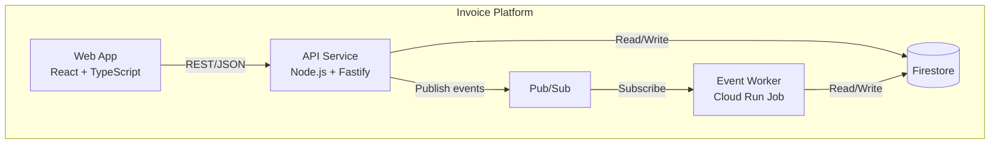
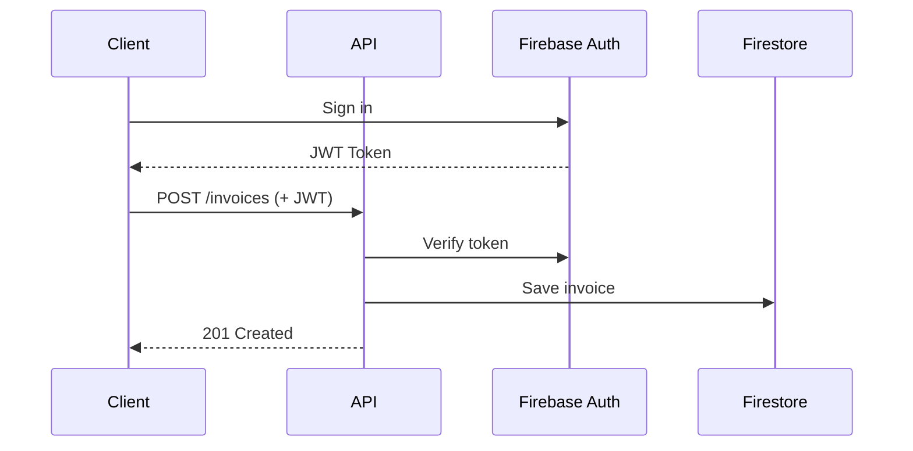
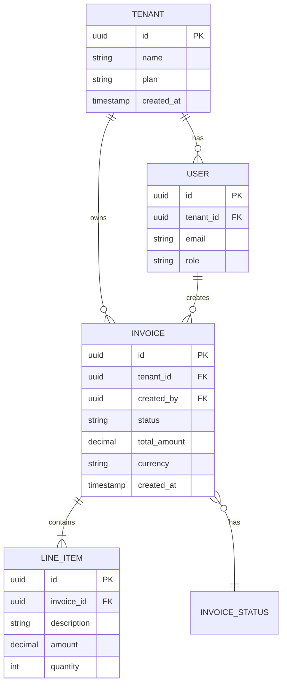
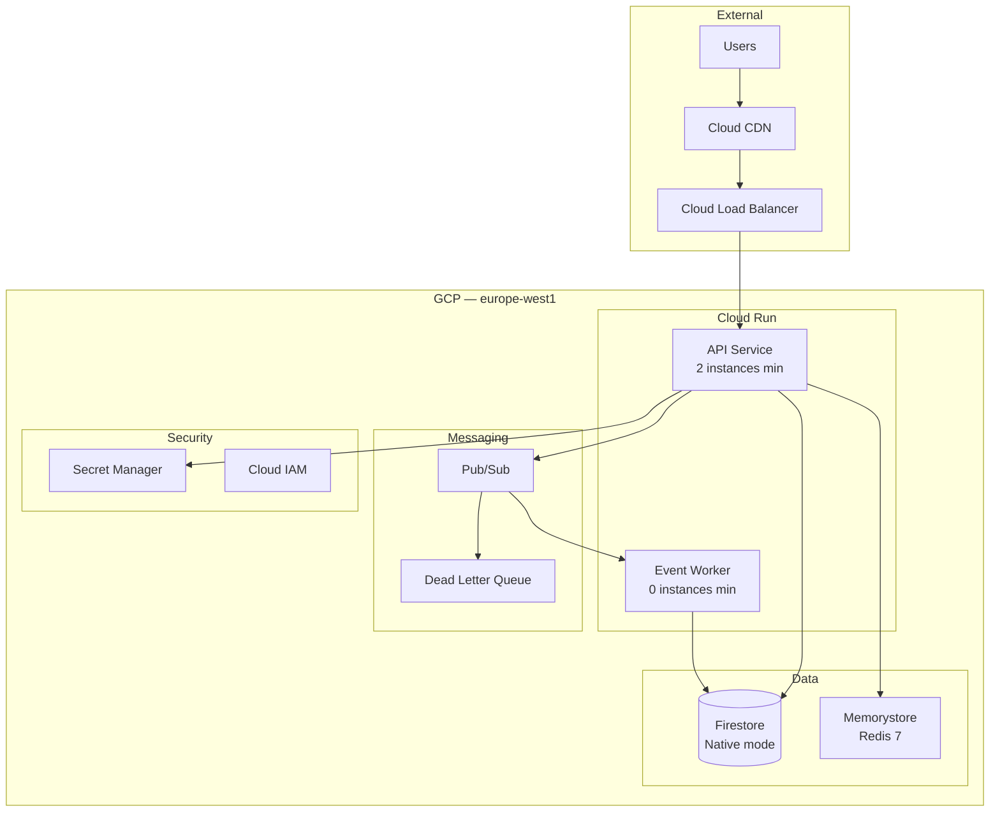
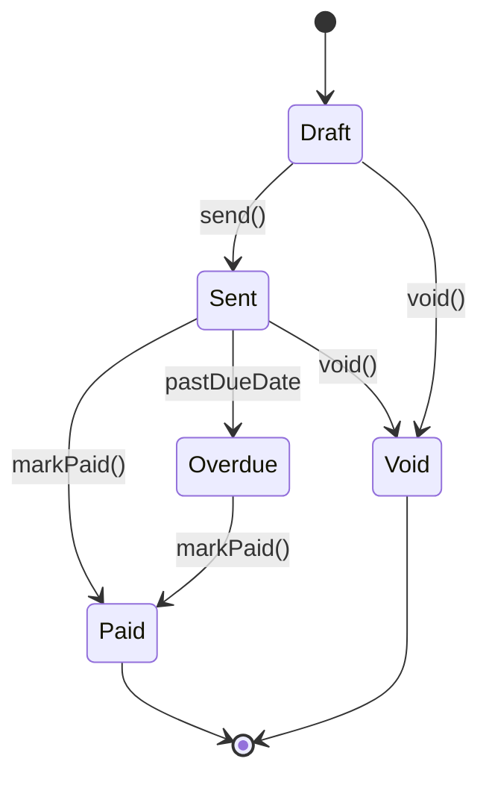

# Diagrams & Visualization

> **Version**: 1.0.0 | **Last updated**: 2026-02-08

## Purpose

Architectural diagrams as code. Mermaid as primary format (renderable in GitHub, IDEs, docs), PlantUML as fallback for complex cases. C4 model as the reference framework.

---

## C4 Model

Four zoom levels, from highest to lowest. Not all are needed — use the levels that communicate the necessary concept.

### Level 1 — System Context

Who uses the system and what it interacts with. External actors (users, third-party systems), the system as a black box, main relationships. **When to use**: for non-technical stakeholders, high-level documentation, onboarding.

### Level 2 — Container

The "containers" (not Docker — applications, databases, message brokers) composing the system. Frontend, backend, database, message queue. **When to use**: for the technical team, infrastructure decisions, architecture reviews.

### Level 3 — Component

Internal components of a container. Modules, services, layers. Useful for complex services.

### Level 4 — Code

Classes and interfaces. Rarely useful as a static diagram — code is the best documentation at this level.

---

## Diagram Types

### Sequence Diagram

For interaction flows between components. Use for: API flows, event-driven flows, saga/choreography, authentication flows.

### Entity Relationship Diagram

For data models. Firestore is schema-less but documents have an implicit structure that must be documented.

### Deployment Diagram

For infrastructure and deployment topology:

### State Diagram

For state machines (invoice status, order status, entity lifecycle).

---

## Principles

**Diagram as code**: Mermaid or PlantUML in the repo, versioned with git. Never PNG/JPG images as source (not modifiable, not diffable).

**One diagram, one concept**: if a diagram tries to show everything, it shows nothing. Each diagram answers a specific question.

**Update or delete**: an obsolete diagram is worse than no diagram. If the system changes, the diagram changes in the same PR.

---

## For Claude Code

When generating diagrams: Mermaid as default, appropriate C4 level for context (Context for stakeholders, Container for technical team), one diagram per concept. Generate sequence diagrams for every non-trivial flow (> 3 actors). Generate state diagrams for every entity with a state machine.

---

*Internal references*: `technical-docs.md`, `architecture-comms.md`, `domain-modeling.md`
