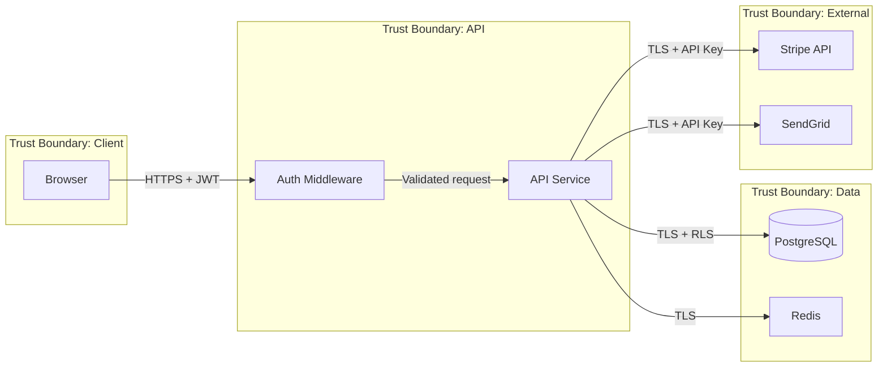

# Diagrams & Visualization

> **Version**: 1.2.0 | **Last updated**: 2026-02-09

## Purpose

Architectural diagrams as code. Mermaid as primary format (renderable in GitHub, IDEs, docs), PlantUML as fallback for complex cases. C4 model as the reference framework.

---

## C4 Model

Four zoom levels, from highest to lowest. Not all are needed — use the levels that communicate the necessary concept.

### Level 1 — System Context

Who uses the system and what it interacts with. External actors (users, third-party systems), the system as a black box, main relationships. **When to use**: for non-technical stakeholders, high-level documentation, onboarding.

### Level 2 — Container

The "containers" (not Docker — applications, databases, message brokers) composing the system. Frontend, backend, database, message queue. **When to use**: for the technical team, infrastructure decisions, architecture reviews.


### Level 3 — Component

Internal components of a container. Modules, services, layers. Useful for complex services.

### Level 4 — Code

Classes and interfaces. Rarely useful as a static diagram — code is the best documentation at this level.

---

## Diagram Types

### Sequence Diagram

For interaction flows between components. Use for: API flows, event-driven flows, saga/choreography, authentication flows.


### Entity Relationship Diagram

For data models. Firestore is schema-less but documents have an implicit structure that must be documented.


### Deployment Diagram

For infrastructure and deployment topology:


### State Diagram

For state machines (invoice status, order status, entity lifecycle).


### Data Flow Diagram

For privacy reviews and compliance (see `compliance-privacy/SKILL.md`). Shows how data moves through the system with trust boundaries:



Use data flow diagrams for: GDPR data mapping, threat modeling (STRIDE), and security reviews.

### PlantUML Example

For diagrams too complex for Mermaid (large sequence diagrams, complex class diagrams):

```plantuml
@startuml
!include https://raw.githubusercontent.com/plantuml-stdlib/C4-PlantUML/master/C4_Container.puml

Person(user, "Business User", "Creates and manages invoices")
System_Boundary(platform, "Invoice Platform") {
  Container(spa, "Web App", "React", "Invoice management UI")
  Container(api, "API Service", "Node.js/Fastify", "Business logic and API")
  ContainerDb(db, "Database", "PostgreSQL", "Stores invoices and users")
  Container(worker, "Event Worker", "Cloud Run Job", "Async processing")
}
System_Ext(stripe, "Stripe", "Payment processing")

Rel(user, spa, "Uses", "HTTPS")
Rel(spa, api, "Calls", "REST/JSON")
Rel(api, db, "Reads/Writes", "TLS")
Rel(api, worker, "Events", "Pub/Sub")
Rel(api, stripe, "Charges", "HTTPS")
@enduml
```

Use PlantUML when: C4 diagrams with PlantUML-C4 library offer better layout than Mermaid C4, or when diagrams need features Mermaid doesn't support (notes, grouping, advanced styling).

---

## Principles

**Diagram as code**: Mermaid or PlantUML in the repo, versioned with git. Never PNG/JPG images as source (not modifiable, not diffable).

**One diagram, one concept**: if a diagram tries to show everything, it shows nothing. Each diagram answers a specific question.

**Update or delete**: an obsolete diagram is worse than no diagram. If the system changes, the diagram changes in the same PR.

---

## For Claude Code

When generating diagrams: Mermaid as default, appropriate C4 level for context (Context for stakeholders, Container for technical team), one diagram per concept. Generate sequence diagrams for every non-trivial flow (> 3 actors). Generate state diagrams for every entity with a state machine.

---

*Internal references*: `technical-documentation/SKILL.md`, `architecture-communication/SKILL.md`, `data-modeling/SKILL.md`
