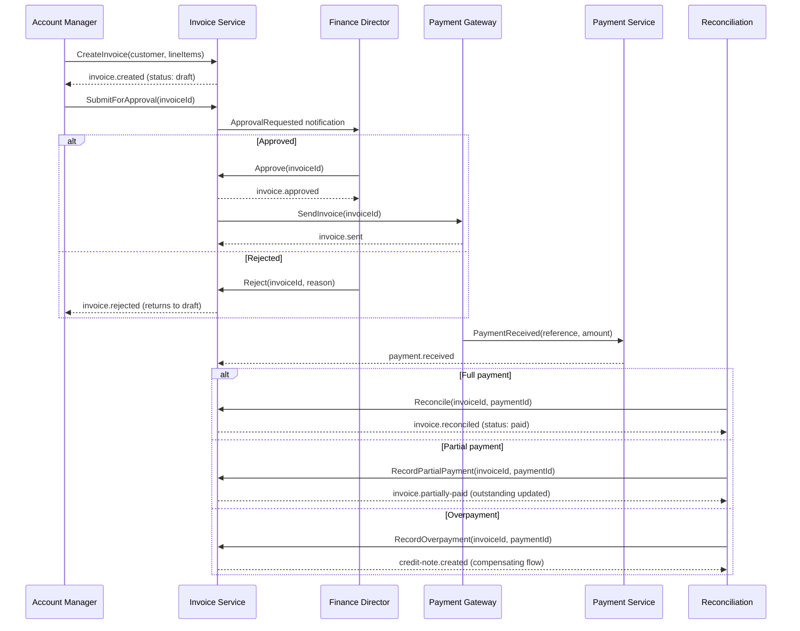
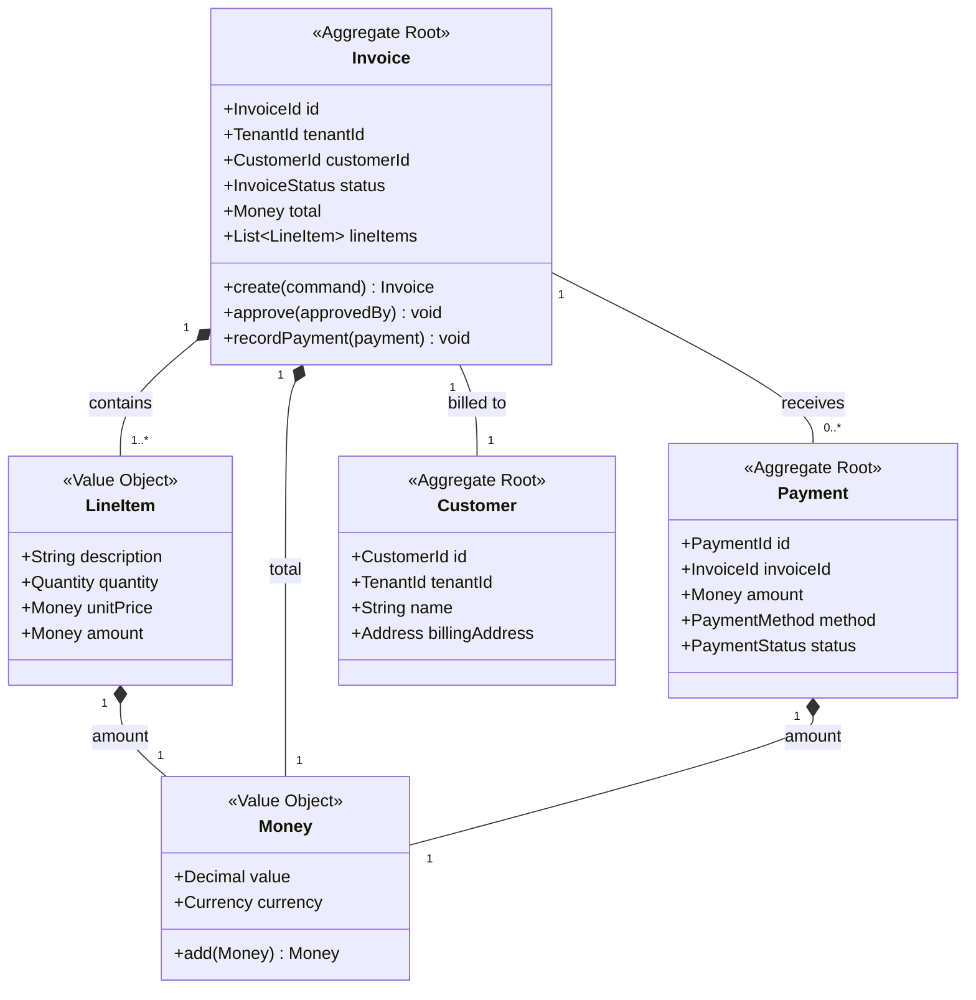
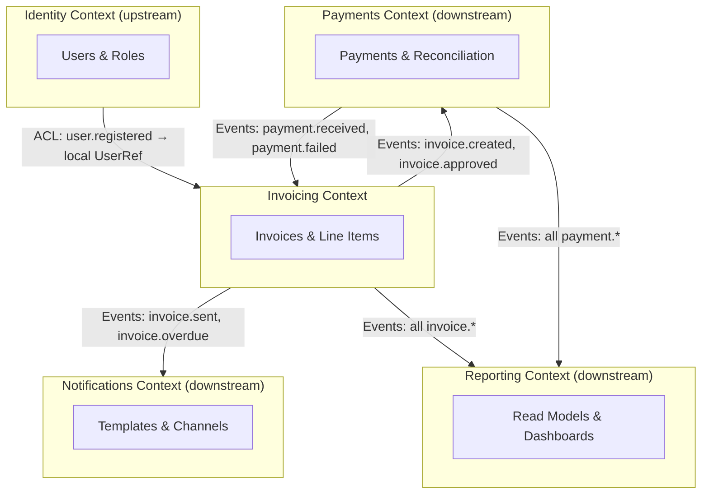

# Functional Analysis

> **Version**: 1.0.0 | **Last updated**: 2026-02-14

## Purpose

Functional analysis is the bridge between business requirements and architecture. It decomposes what the system does into structured, analyzable flows — independent of technology choices. This is the work that happens BEFORE designing databases, APIs, or services: understanding the domain, its processes, its rules, and its boundaries. Without functional analysis, technical design is guesswork dressed as engineering.

---

## Domain Analysis Method

A four-step structured approach. Each step produces a concrete artifact. Do not skip steps — each builds on the previous.

### Step 1: Domain Event Storming (Lightweight)

Identify domain events (past-tense facts that matter to the business), the commands that trigger them, and the aggregates that enforce the rules.

**Process**: list every business-meaningful event in the domain. Group events by the aggregate that produces them. Identify the command (user action or system trigger) that causes each event. Map temporal dependencies between events.

**Output**: event flow timeline showing command → aggregate → event chains, ordered chronologically across the business process.

### Step 2: Actor-Action Mapping

Enumerate every actor (human role, external system, scheduled job) and every action they perform. This is the exhaustive inventory of entry points into the system.

| Actor | Action | Trigger | Target Aggregate | Resulting Event |
|-------|--------|---------|-------------------|-----------------|
| Account Manager | Create invoice | Manual | Invoice | invoice.created |
| Finance Director | Approve invoice | Manual | Invoice | invoice.approved |
| Scheduler | Send overdue reminders | Cron (daily) | Invoice | invoice.reminder-sent |
| Payment Gateway | Notify payment received | Webhook | Payment | payment.received |

### Step 3: Business Rule Extraction

For each aggregate, extract: **invariants** (must always be true), **pre-conditions** (must be true before a command executes), **post-conditions** (must be true after a command executes), **constraints** (limits, ranges, cardinality).

```
Aggregate: Invoice
  Invariant: total = sum(line_items.amount)
  Invariant: invoice belongs to exactly one tenant
  Pre-condition(approve): status == 'draft' AND line_items.length > 0
  Post-condition(approve): status == 'approved' AND approved_by is set
  Constraint: max 500 line items per invoice
  Constraint: amount > 0 for every line item
```

### Step 4: Domain Glossary

Define every domain term precisely. This is the ubiquitous language — if stakeholders use different words for the same concept, or the same word for different concepts, resolve it here.

| Term | Definition | Bounded Context | Aliases |
|------|-----------|-----------------|---------|
| Invoice | A request for payment issued to a customer for goods or services delivered | Invoicing | Bill (deprecated) |
| Line Item | A single entry on an invoice representing a specific charge | Invoicing | — |
| Reconciliation | Matching a received payment against an outstanding invoice | Payments | Settlement |

---

## Functional Flow Analysis

Decompose every business process into four flow types. Never document only the happy path — the alternative and exception paths are where complexity lives.

**Happy path**: the standard successful flow. **Alternative paths**: valid variations (e.g., partial payment, bulk approval). **Exception paths**: error conditions and how the system responds (e.g., payment declined, duplicate invoice detected). **Compensating flows**: how to undo or correct a completed step (e.g., credit note for an overpayment).

### Example: Invoice Lifecycle



---

## Use Case Specification Template

```markdown
### UC-{ID}: {Title}

**Actor**: {primary actor}
**Trigger**: {what initiates this use case}

**Pre-conditions**:
1. {condition that must be true before execution}

**Main Flow**:
1. {Actor} performs {action}
2. System validates {what}
3. System executes {operation}
4. System emits {domain event}
5. System returns {response}

**Alternative Flows**:
- 2a. Validation fails: system returns error with field-level detail
- 3a. {Variation}: system {different behavior}

**Exception Flows**:
- 3e. {External dependency} unavailable: system {degradation strategy}
- 4e. Event publish fails: system retries with outbox pattern

**Post-conditions**:
1. {condition that must be true after successful execution}

**Business Rules**:
- BR-{N}: {rule description}

**Data Requirements**:
| Field | Type | Required | Constraints |
|-------|------|----------|-------------|
| {field} | {type} | {yes/no} | {validation rules} |

**NFR Implications**:
- Latency: {expected response time}
- Throughput: {expected volume}
- Consistency: {strong/eventual}
```

---

## Domain Model

Produce domain models using Mermaid classDiagram. Show entities, value objects, aggregates (with explicit boundaries), relationships with cardinality, and domain events emitted by each aggregate.

### Example: Invoicing Domain Model



Aggregates define transaction boundaries. Operations that span two aggregates require eventual consistency via domain events, not distributed transactions.

---

## Bounded Context Mapping

Functional analysis drives service decomposition. The rules: tightly-related use cases sharing the same ubiquitous language belong in one bounded context. When an entity means different things in different contexts (e.g., "Customer" in billing vs support), that is a context boundary. Shared entities that appear in multiple contexts become integration points requiring explicit contracts.

### Context Relationship Types

| Relationship | Meaning | Integration Pattern |
|-------------|---------|-------------------|
| Upstream/Downstream | One context supplies data the other consumes | Events or API calls |
| Shared Kernel | Two contexts share a small, co-owned model | Shared library with joint ownership |
| Customer/Supplier | Downstream has influence over upstream's API | Negotiated API contract |
| Conformist | Downstream accepts upstream's model as-is | Direct model adoption |
| Anti-Corruption Layer | Downstream translates upstream's model | Adapter/translator at boundary |

### Example: Context Map



Where an Anti-Corruption Layer (ACL) appears, the downstream context translates the upstream model into its own language. The Invoicing context does not store a full `User` entity — it stores a `UserRef` value object with only the fields it needs.

---

## Functional Specification Document Template

```markdown
# Functional Specification: {Feature/Domain Name}

## 1. Overview
{2-3 sentences: what this feature/domain does and why it exists}

## 2. Actors
| Actor | Type | Description |
|-------|------|-------------|
| {name} | {human/system/scheduler} | {what they do} |

## 3. Domain Model
{Mermaid classDiagram showing entities, value objects, aggregates}

## 4. Glossary
| Term | Definition | Context |
|------|-----------|---------|
| {term} | {precise definition} | {bounded context} |

## 5. Use Cases
### UC-001: {Title}
{Full use case specification per template above}

## 6. Process Flows
{Mermaid sequence diagrams for each major flow}

## 7. Business Rules Catalog
| ID | Rule | Aggregate | Enforcement |
|----|------|-----------|-------------|
| BR-001 | {description} | {aggregate} | {where/how enforced} |

## 8. Data Requirements
| Entity | Field | Type | Constraints | Owner Context |
|--------|-------|------|-------------|---------------|
| {entity} | {field} | {type} | {rules} | {context} |

## 9. Integration Points
| Source Context | Target Context | Mechanism | Data Exchanged |
|---------------|---------------|-----------|----------------|
| {source} | {target} | {events/API/shared kernel} | {what} |

## 10. NFR Implications
| Requirement | Target | Justification |
|-------------|--------|---------------|
| {e.g., latency} | {e.g., p99 < 200ms} | {why} |

## 11. Open Questions
- [ ] {unresolved decision or ambiguity}
```

---

## Anti-Patterns

- **Technology-first analysis**: jumping to database schemas, API endpoints, or service boundaries before understanding the domain — produces solutions to the wrong problem
- **Happy-path-only specification**: documenting only the success flow and ignoring exceptions, compensating flows, and edge cases — guarantees surprises in production
- **Ambiguous glossary**: allowing the same term to mean different things in different contexts without explicit resolution — creates miscommunication between teams and bugs at integration points
- **God aggregate**: a single aggregate that owns too many invariants and handles too many commands — signals a missed bounded context boundary that must be split
- **Premature decomposition**: splitting into microservices before completing domain analysis — leads to wrong service boundaries that are expensive to fix later
- **Missing actor inventory**: not exhaustively listing all actors including system actors, schedulers, and external webhooks — results in undiscovered entry points and unhandled flows
- **Business rules in prose**: describing rules in paragraph form instead of structured invariants and pre/post-conditions — makes them unverifiable and easy to misimplement

---

## For Claude Code

When performing functional analysis: always complete all four domain analysis steps (event storming, actor-action mapping, business rule extraction, domain glossary) before producing any technical artifact. Generate use case specifications using the template for every non-trivial flow, including alternative and exception paths. Produce domain models as Mermaid classDiagrams with explicit aggregate boundaries and value objects. Map bounded contexts from the domain analysis output before suggesting service decomposition. Include Mermaid sequence diagrams for every process flow showing happy path, alternatives, and exceptions. Generate the functional specification document template pre-filled with the analysis results. Never skip the glossary — ambiguous language is the root cause of integration bugs. When the user asks for architecture or service design, start with functional analysis and present findings before proposing technical solutions.

---

*Internal references*: `integration-design/SKILL.md`, `nfr-specification/SKILL.md`, `microservices-patterns/SKILL.md`, `data-modeling/SKILL.md`, `event-driven-architecture/SKILL.md`
