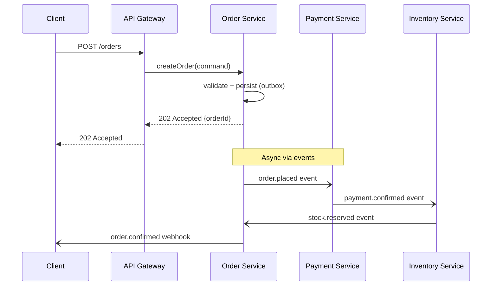
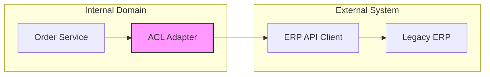

# Integration Design

> **Version**: 1.0.0 | **Last updated**: 2026-02-14

## Purpose

Integration design defines how systems, services, and components communicate across boundaries. It takes the integration points identified in functional specifications and turns them into concrete contracts, data flows, and interaction patterns. Covers both intra-platform integration (services within the ecosystem) and inter-system integration (external systems, third-party APIs, legacy systems).

---

## Integration Pattern Catalog

Select the pattern based on the interaction requirements. Default to async events unless the caller needs an immediate response.

| Pattern | When to Use | Latency | Coupling | Reliability | Complexity |
|---------|-------------|---------|----------|-------------|------------|
| **Sync REST** | Public APIs, simple CRUD queries, client needs immediate response | Low (ms) | High | Medium | Low |
| **Sync gRPC** | Internal high-throughput service-to-service, streaming | Very low | High | Medium | Medium |
| **Async Events (Pub/Sub)** | Decoupled notifications, eventual consistency acceptable | High (s-min) | Very low | High (with DLQ) | Medium |
| **Async Commands (Queue)** | Directed work dispatch to a specific consumer | High (s-min) | Low | High (with DLQ) | Medium |
| **Batch/File** | Bulk data exchange, nightly ETL, partner feeds | Very high (h) | Very low | High | Low |
| **Webhooks** | External system notifications, third-party callbacks | Medium (s) | Low | Medium | Low |
| **Shared Database** | **NEVER** — breaks autonomy, creates hidden coupling | N/A | Extreme | N/A | N/A |
| **API Gateway Aggregation** | Client needs data from multiple services in one call | Low-Medium | Medium | Medium | Medium |

---

## Integration Design Method

Six-step approach from functional analysis to implementable integration contracts.

### Step 1: Map Integration Points

Extract every boundary crossing from the functional specification. For each, record: source system, target system, data exchanged, trigger (user action, schedule, event), and business criticality.

### Step 2: Classify Each Integration Point

For every integration point, determine: pattern (from catalog above), direction (inbound, outbound, bidirectional), expected volume (events/second or records/batch), consistency requirement (strong, eventual, best-effort), and latency tolerance (real-time, near-real-time, batch).

### Step 3: Define Contracts

Define the request, response, or event schema for each integration point. Use OpenAPI for REST, Protobuf for gRPC, AsyncAPI for events. Contracts are the source of truth — code is generated from them, not the other way around.

```typescript
// Zod schema as contract definition — shared between producer and consumer
import { z } from 'zod';

const OrderPlacedEventV1 = z.object({
  orderId: z.string().uuid(),
  tenantId: z.string().uuid(),
  customerId: z.string().uuid(),
  items: z.array(z.object({
    productId: z.string().uuid(),
    quantity: z.number().int().positive(),
    unitPrice: z.number().positive(),
  })),
  totalAmount: z.number().positive(),
  currency: z.string().length(3),
  placedAt: z.string().datetime(),
});

type OrderPlacedEventV1 = z.infer<typeof OrderPlacedEventV1>;
```

### Step 4: Sequence Interactions

Model the interaction flow with sequence diagrams — one for the happy path, one for each significant error path.



### Step 5: Handle Failure Modes

For each integration point, define: retry policy (max attempts, backoff), circuit breaker thresholds, fallback behavior (cached response, default, degraded), dead letter queue handling, and alerting rules.

### Step 6: Document Data Transformations

When data crosses boundaries, models rarely match. Document the mapping explicitly — source field to target field, transformation logic, default values for missing fields.

```typescript
// ACL transformer: external ERP order → internal order model
function fromErpOrder(erp: ErpOrderResponse): CreateOrderInput {
  return {
    externalId: erp.ORDER_NUM,
    tenantId: lookupTenantByErpCode(erp.COMPANY_CODE),
    items: erp.LINE_ITEMS.map((li) => ({
      productId: mapErpSku(li.SKU),
      quantity: li.QTY,
      unitPrice: Number(li.UNIT_PRICE),
    })),
    currency: erp.CURRENCY_ISO ?? 'USD',
    placedAt: parseErpDate(erp.ORDER_DATE),
  };
}
```

---

## Integration Design Document Template

Use this structure for every non-trivial integration.

```markdown
# Integration Design: [System A] ↔ [System B]

## Overview
[1-2 sentences: what this integration achieves and why it exists.]

## System Context
[C4 System Context diagram in Mermaid showing the systems and their relationships.]

## Integration Points

### IP-1: [Name]
- **Direction**: Inbound / Outbound / Bidirectional
- **Pattern**: [from catalog]
- **Trigger**: [user action / schedule / event]
- **Contract**: [link to OpenAPI/AsyncAPI/Protobuf spec]
- **Data Mapping**: [source field → target field table]
- **NFRs**: [throughput, latency, availability]
- **Failure Handling**: [retry, circuit breaker, fallback, DLQ]
- **Idempotency**: [mechanism — event ID, idempotency key, natural key]

### IP-2: [Name]
[repeat structure]

## Sequence Diagrams
### Happy Path
[Mermaid sequence diagram]

### Error: [failure scenario]
[Mermaid sequence diagram]

## Data Flow Summary
| # | Source | Target | Pattern | Trigger | Volume | Consistency |
|---|--------|--------|---------|---------|--------|-------------|

## Security
- **Authentication per point**: [OAuth2 client credentials, API key, mTLS]
- **Data sensitivity**: [PII fields, encryption requirements]
- **Network**: [VPC peering, private endpoint, public with WAF]

## Monitoring
- **Health checks**: [endpoint per integration point]
- **SLOs**: [availability, latency p99, error rate]
- **Alerts**: [DLQ depth, circuit breaker open, error rate spike]
```

---

## Anti-Corruption Layer (ACL)

### When Mandatory

An ACL is required when integrating with external systems (third-party APIs, partner feeds), legacy systems with a different domain model, or any system you do not control. The ACL translates between the external model and the internal domain model, preventing external concepts from leaking into the core domain.

### When Optional

Between internal services with aligned domain models in the same bounded context family. Even here, consider a thin translation layer if models are likely to diverge.

### ACL Placement



The ACL consists of three components: **adapter** (translates external protocol/format), **translator** (maps external model to internal model), and **facade** (simplifies the external API surface). The internal domain never imports types from the external system. All external types live inside the ACL boundary.

```typescript
// ACL boundary — external types stay here, internal domain is clean
interface ErpAdapter {
  getOrder(erpOrderId: string): Promise<CreateOrderInput>;  // returns internal type
  syncInventory(productId: string): Promise<StockLevel>;     // returns internal type
}

class SapErpAdapter implements ErpAdapter {
  constructor(private readonly client: SapApiClient) {}

  async getOrder(erpOrderId: string): Promise<CreateOrderInput> {
    const raw = await this.client.fetchOrder(erpOrderId);  // external type
    return fromErpOrder(raw);                               // translate to internal
  }
}
```

---

## Data Consistency Across Boundaries

No distributed transactions. Choose the right consistency pattern per integration point.

| Approach | Mechanism | Consistency | Use When |
|----------|-----------|-------------|----------|
| **Saga (orchestration)** | Coordinator sends commands, handles compensations | Eventual | Multi-step cross-service workflow with complex compensation logic |
| **Eventual consistency (events)** | Producer publishes event, consumers update independently | Eventual | Decoupled services, no coordination needed, consumer can lag |
| **Two-phase confirmation** | Request → Reserve → Confirm/Cancel | Eventual (time-bounded) | Resource reservation (seats, inventory, payment authorization) |

**Saga**: use when steps must execute in order and each step has a defined compensating action. See `event-driven-architecture/SKILL.md` for orchestration vs choreography decision.

**Eventual consistency with events**: simplest pattern. Producer publishes, consumers update their local state. Accept that reads may be stale. Design UIs to reflect "processing" state.

**Two-phase confirmation**: caller requests a tentative reservation, receives a reservation ID with a TTL, then confirms or cancels. If TTL expires without confirmation, the reservation auto-cancels. Use for inventory holds, payment pre-authorizations, seat reservations.

```typescript
// Two-phase confirmation: reserve → confirm
const reservation = await inventoryService.reserve({
  productId, quantity, ttlSeconds: 300,
});
// ... process payment ...
await inventoryService.confirm(reservation.reservationId);
// If payment fails:
await inventoryService.cancel(reservation.reservationId);
```

---

## Contract-First Design

Define the contract before writing implementation code. The contract is the single source of truth.

**Workflow**: design contract (OpenAPI, AsyncAPI, Protobuf) → review contract with consumer team → generate server stubs and client SDKs → implement against the stubs → validate with contract tests.

**Contract types by pattern**:
- REST: OpenAPI 3.1 specification
- gRPC: Protocol Buffers `.proto` files
- Events: AsyncAPI 3.0 specification
- Batch/file: JSON Schema or Avro schema

**Breaking change detection**: run schema diff in CI. A breaking change is: removing a field, changing a field type, renaming a field, changing a required field to a different meaning. Adding optional fields is always safe.

**Contract registry**: store all contracts in a central repository or monorepo directory (`contracts/`). Version contracts independently using SemVer. Consumer teams pin to a contract version and upgrade on their own schedule.

```yaml
# asyncapi.yaml — event contract
asyncapi: 3.0.0
info:
  title: Order Events
  version: 1.0.0
channels:
  orderPlaced:
    address: order.placed
    messages:
      orderPlaced:
        payload:
          $ref: '#/components/schemas/OrderPlacedV1'
```

---

## Legacy Integration Patterns

**Strangler Fig**: route traffic through a facade that delegates to the legacy system. Incrementally move functionality to the new system. The facade switches routing per endpoint as each is migrated. Never big-bang replace.

**Change Data Capture (CDC)**: capture row-level changes from the legacy database (Debezium, Cloud SQL change streams) and publish as events. Use when the legacy system cannot emit events and you cannot modify its code.

**API Facade**: wrap the legacy system's raw interface (SOAP, FTP, stored procedures) behind a modern REST or gRPC API. The facade handles protocol translation, authentication, and error normalization. Internal services call the facade, never the legacy system directly.

---

## Anti-Patterns

- **Shared database integration**: two systems reading/writing the same tables — creates invisible coupling, makes independent evolution impossible, and turns schema changes into cross-team coordination nightmares
- **Chatty integration**: a single business operation requires 10+ cross-boundary calls — indicates wrong boundaries or missing aggregation layer
- **Contract-last design**: implementing first and extracting the contract afterward — leads to leaky abstractions that expose internal implementation details
- **Missing ACL for external systems**: importing third-party API types directly into the domain model — when the external system changes, the change ripples through the entire codebase
- **Synchronous chain across boundaries**: service A → B → C → D in a synchronous call chain — latency compounds, any failure cascades, and the system is as reliable as its least reliable link
- **Fire-and-forget without DLQ**: publishing events or commands with no dead letter queue — failed messages vanish silently, causing silent data loss
- **Hardcoded endpoint URLs**: embedding partner URLs, webhook endpoints, or service addresses in application code — use configuration, service discovery, or environment variables

---

## For Claude Code

When designing integrations: start by listing every boundary crossing and classifying each with pattern, direction, volume, consistency, and latency requirements. Default to async events for inter-service communication; use sync calls only when the caller requires an immediate response. Define contracts (OpenAPI, AsyncAPI, Protobuf) before writing implementation code — generate server stubs and client SDKs from contracts. Wrap every external system integration in an anti-corruption layer with adapter, translator, and facade — never import external types into the domain model. For cross-boundary data consistency, use sagas for multi-step workflows and eventual consistency with events for decoupled updates. Include failure handling for every integration point: retry with backoff, circuit breaker, fallback, and DLQ. Generate the integration design document using the template above for any non-trivial integration. Document all data transformations explicitly with mapping functions. Every integration point must have monitoring: health checks, SLOs, and alerts on DLQ depth and error rate.

---

*Internal references*: `functional-analysis/SKILL.md`, `api-design/SKILL.md`, `event-driven-architecture/SKILL.md`, `microservices-patterns/SKILL.md`, `error-handling-resilience/SKILL.md`, `legacy-modernizer/SKILL.md`
