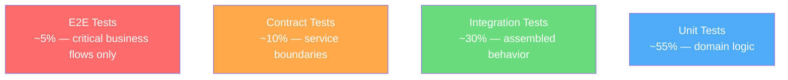

# Testing Strategy

> **Version**: 1.3.0 | **Last updated**: 2026-02-14

## Purpose

A testing strategy that produces real confidence, not cosmetic coverage. The right test at the right level, with minimum effort for maximum signal.

---

## Test Pyramid — Revisited

The classic pyramid (many unit, fewer integration, very few E2E) is a starting point, not dogma. In cloud-native applications with many services, integration and contract tests have more value than unit tests on trivial logic.



**Unit test**: for pure domain logic (entities, value objects, calculations, validations). Fast, isolated, deterministic. Not for code that's just wiring (route -> service -> repository with zero logic).

**Integration test**: for assembled system behavior (API endpoint with real database or test container, event handler with real messaging). This is where real bugs are found.

**Contract test**: for interfaces between services. The producer verifies it respects the contract, the consumer verifies it can handle the producer's responses. Pact or schema-based contracts (OpenAPI).

**E2E test**: for critical business flows (login -> create invoice -> send -> verify status). Few, slow, fragile. Only for flows that, if broken, block the business.

### Test Type Decision Matrix

| Scenario | Test Type | Why |
|----------|-----------|-----|
| Pure calculation or validation | Unit | No dependencies, fast, deterministic |
| State machine transition | Unit | Domain logic with clear inputs/outputs |
| API endpoint with DB | Integration | Tests real wiring, catches config bugs |
| Event handler with side effects | Integration | Verifies async pipeline works |
| Service-to-service interface | Contract | Prevents integration breakage at deploy |
| Login -> Purchase -> Confirm flow | E2E | Critical business path, high blast radius |
| UI component rendering | Component (unit) | Tests user-visible behavior |
| Route wiring without logic | Skip or integration | Don't unit test plumbing |

---

## Coverage Rules

**Branch coverage > line coverage.** 100% line coverage with 0% branch coverage means you tested the happy path and ignored all errors.

**Targets**: 80% branch coverage on domain layer, 70% on application layer, 50% on infra layer (tested more through integration than unit). Global target: 70%.

**Zero coverage acceptable on**: generated code, configuration, trivial glue code, pure TypeScript types.

**Coverage as signal, not goal.** If you have 90% coverage and bugs still pass, the tests are wrong (testing implementation, not behavior). If you have 60% and no bugs pass, maybe 60% is sufficient.

### Coverage Regression Detection

Coverage must not drop by more than 2% from the main branch baseline. CI enforces this:

```yaml
# In CI pipeline
- name: Check coverage regression
  run: |
    MAIN_COVERAGE=$(cat coverage-baseline.json | jq '.total.branches.pct')
    PR_COVERAGE=$(cat coverage/coverage-summary.json | jq '.total.branches.pct')
    DIFF=$(echo "$PR_COVERAGE - $MAIN_COVERAGE" | bc)
    if (( $(echo "$DIFF < -2" | bc -l) )); then
      echo "FAIL: Coverage dropped by ${DIFF}% (threshold: -2%)"
      exit 1
    fi
```

---

## Test Naming Convention

Tests describe behavior, not implementation:

```
should_<expected result>_when_<condition>
```

Examples:
- `should_reject_negative_amount_when_creating_invoice`
- `should_return_403_when_accessing_other_tenant_data`
- `should_send_notification_when_invoice_is_overdue`

In Vitest/Jest:
```typescript
describe('InvoiceCreation', () => {
  it('rejects negative amounts', () => { ... });
  it('assigns draft status to new invoices', () => { ... });
  it('requires tenant context', () => { ... });
});
```

---

## What to Test (priority order)

Business rules (domain invariants, calculations, state machines), error handling (what happens when DB is down, input is invalid, tenant doesn't exist), security boundaries (authentication, authorization, tenant isolation), integrations (external APIs, database, messaging), critical UI flows (E2E only for business-critical flows).

---

## What NOT to Test

Getters/setters without logic. Framework code (React render, Express routing). Internal implementation (call order, private variables). Mock on mock on mock (if the test has more mocks than assertions, it's testing the mock framework, not the code).

---

## Test-First vs Test-After

| Approach | When to Use |
|----------|-------------|
| Test-first (TDD) | Complex domain logic, state machines, algorithms — where the test defines the expected behavior before implementation |
| Test-after | CRUD operations, wiring code, exploratory prototyping — where the implementation is straightforward |
| Spike then test | Unknown territory — prototype without tests, then rewrite with tests once the approach is clear |

Rule: test-first is the default for domain logic. Test-after is acceptable for infrastructure wiring. No tests is never acceptable for production code.

---

## Flaky Test Policy

A flaky test (passes/fails non-deterministically) is a broken test.

**Process**: detect flaky test (CI reports intermittent failure) -> quarantine immediately (move to separate suite, exclude from blocking gate) -> create ticket with P2 priority -> fix or delete within 1 sprint.

**Quarantine rules**: quarantined tests run in a separate non-blocking CI job. Quarantined tests count as tech debt. More than 5 quarantined tests triggers a team discussion. A test quarantined for > 2 sprints is deleted.

**Common causes**: time-dependent logic, shared state between tests, race conditions in async code, external service dependencies. Fix the root cause, not the symptom (don't add `sleep()`).

---

## Mutation Testing

Mutation testing verifies that your tests actually catch bugs by introducing small code changes (mutations) and checking if tests fail.

**Tool**: Stryker Mutator for TypeScript.

```bash
# Install and run Stryker
npx stryker init  # generates stryker.config.json
npx stryker run
```

**Mutation score** = killed mutants / total mutants. Target: > 70% on domain logic. Run mutation testing on domain layer only (not infrastructure or UI) — too slow for full codebase.

Use mutation testing to find: tests that always pass regardless of code changes, missing edge case coverage, assertions that are too weak (`toBeTruthy()` instead of specific value checks).

---

## Accessibility Testing

Automated accessibility checks catch ~30% of issues. Integrate in CI:

```typescript
// In Playwright E2E tests
import AxeBuilder from '@axe-core/playwright';

test('invoice page is accessible', async ({ page }) => {
  await page.goto('/invoices');
  const results = await new AxeBuilder({ page }).analyze();
  expect(results.violations).toEqual([]);
});
```

Run axe-core in CI on every page/component. Manual testing still needed for: keyboard navigation flows, screen reader experience, focus management.

---

## Visual Regression Testing

Catch unintended UI changes by comparing screenshots:

**Tools**: Playwright visual comparisons, Percy, Chromatic (for Storybook).

```typescript
// Playwright visual comparison
test('invoice form matches baseline', async ({ page }) => {
  await page.goto('/invoices/new');
  await expect(page).toHaveScreenshot('invoice-form.png', { maxDiffPixelRatio: 0.01 });
});
```

Run on: component library changes, CSS refactors, dependency updates affecting UI. Not on every PR (too noisy) — trigger on relevant path changes.

---

## Tests as Documentation

Every test suite has a name describing behavior, not implementation. `describe('InvoiceCreation')` with `it('rejects negative amounts')`, not `describe('createInvoice function')` with `it('calls repository.save')`.

---

## Contract Testing

In a microservices ecosystem, integration tests between services are slow and fragile. Contract tests verify that service interfaces remain compatible without requiring both services to run simultaneously.

### Consumer-Driven Contracts (CDC)

The consumer defines what it expects from the provider. The provider verifies it satisfies all consumer contracts. This catches breaking changes before deployment — the provider knows exactly who depends on what.

### Pact Workflow

1. Consumer writes a Pact test defining expected interactions
2. Test generates a contract file (pact JSON)
3. Contract shared with provider (Pact Broker or CI artifact)
4. Provider verifies against all consumer contracts

```typescript
// Consumer test (invoice-ui consuming user-service)
import { PactV3 } from '@pact-foundation/pact';

const provider = new PactV3({ consumer: 'invoice-ui', provider: 'user-service' });

describe('User Service Contract', () => {
  it('returns user by ID', async () => {
    await provider
      .given('user with ID user_123 exists')
      .uponReceiving('a request for user user_123')
      .withRequest({ method: 'GET', path: '/api/v1/users/user_123' })
      .willRespondWith({
        status: 200,
        body: {
          id: 'user_123',
          name: MatchersV3.string('Jane Doe'),
          email: MatchersV3.email(),
        },
      })
      .executeTest(async (mockServer) => {
        const client = new UserClient(mockServer.url);
        const user = await client.getUser('user_123');
        expect(user.id).toBe('user_123');
        expect(user.name).toBeDefined();
      });
  });
});
```

```typescript
// Provider verification test (user-service)
import { Verifier } from '@pact-foundation/pact';

describe('User Service Provider Verification', () => {
  it('satisfies all consumer contracts', async () => {
    await new Verifier({
      providerBaseUrl: 'http://localhost:3000',
      pactUrls: ['./pacts/invoice-ui-user-service.json'],
      stateHandlers: {
        'user with ID user_123 exists': async () => {
          await seedTestUser({ id: 'user_123', name: 'Jane Doe', email: 'jane@example.com' });
        },
      },
    }).verifyProvider();
  });
});
```

### Schema-Based Contracts for Events

For event-driven systems, use JSON Schema or Avro schema registry. Schema evolution rules: additive changes (new optional field) are backward-compatible, removals are breaking. Cross-reference: `event-driven-architecture/SKILL.md`.

### When to Use

Every service-to-service boundary, every public API, every event schema. Contract tests are lightweight and fast — there's no reason to skip them.

**Anti-pattern**: contract tests that test implementation details instead of the interface contract. A contract test should verify the shape and semantics of the response, not how the provider generates it internally.

---

## Test Data Management

Inconsistent or leaked test data causes flaky tests, tenant isolation violations, and wasted debugging time.

### Factory Pattern

Typed factory functions that produce valid test entities with sensible defaults. Every factory accepts partial overrides for specific test scenarios:

```typescript
interface TestInvoice {
  id: string;
  tenantId: string;
  amount: number;
  currency: string;
  status: 'draft' | 'sent' | 'paid';
  createdAt: Date;
}

function createTestInvoice(overrides: Partial<TestInvoice> = {}): TestInvoice {
  return {
    id: `inv_${randomUUID()}`,
    tenantId: `tenant_test_${randomUUID().slice(0, 8)}`,
    amount: 100_00,          // cents
    currency: 'EUR',
    status: 'draft',
    createdAt: new Date(),
    ...overrides,
  };
}

// Usage in tests
const paidInvoice = createTestInvoice({ status: 'paid', amount: 500_00 });
const otherTenantInvoice = createTestInvoice({ tenantId: 'tenant_other' });
```

### Test Tenant Isolation

Every test suite operates in a dedicated test tenant. No test writes to shared tenants. This prevents cross-test contamination and ensures tests are independent.

### Cleanup Strategy

- **Unit tests**: no cleanup needed (pure functions, no side effects)
- **Integration tests**: truncate tables or use transaction rollback after each test
- **E2E tests**: dedicated test tenant with automated cleanup in `afterAll`

### Fixture Layering

| Layer | Purpose | Example |
|-------|---------|---------|
| **Base fixtures** | Minimal valid entity | `createTestInvoice()` with defaults |
| **Scenario fixtures** | Specific business state | `createPaidInvoice()`, `createOverdueInvoice()` |
| **Edge case fixtures** | Boundary conditions | `createInvoiceWithMaxAmount()`, `createInvoiceWithUnicode()` |

**Anti-pattern**: shared mutable test data across test suites. This creates ordering dependencies — tests pass when run together but fail when run individually or in different order.

---

## Resilience Testing

Resilience code (circuit breakers, retries, timeouts) is critical infrastructure that is almost never tested. When it fails, it fails in production under load — the worst time to discover a bug.

### Fault Injection in Unit Tests

Inject slow responses, timeouts, and errors through dependency injection. Test that resilience mechanisms activate correctly:

```typescript
import { describe, it, expect, vi } from 'vitest';

function createFailingDependency(failCount: number): () => Promise<string> {
  let calls = 0;
  return async () => {
    calls++;
    if (calls <= failCount) throw new Error(`Simulated failure ${calls}`);
    return 'success';
  };
}

function createSlowDependency(delayMs: number): () => Promise<string> {
  return () => new Promise((resolve) => setTimeout(() => resolve('slow-success'), delayMs));
}

describe('CircuitBreaker', () => {
  it('opens after failure threshold and rejects immediately', async () => {
    const breaker = new CircuitBreaker('test-dep', { failureThreshold: 3, resetTimeoutMs: 1000 });
    const failingFn = createFailingDependency(10);

    // 3 failures should open the circuit
    for (let i = 0; i < 3; i++) {
      await expect(breaker.execute(failingFn)).rejects.toThrow();
    }

    // Next call should fail immediately with circuit-open
    await expect(breaker.execute(failingFn)).rejects.toMatchObject({ kind: 'circuit-open' });
  });

  it('recovers after reset timeout', async () => {
    vi.useFakeTimers();
    const breaker = new CircuitBreaker('test-dep', { failureThreshold: 2, resetTimeoutMs: 5000 });
    const dep = createFailingDependency(2); // Fails twice, then succeeds

    await expect(breaker.execute(dep)).rejects.toThrow();
    await expect(breaker.execute(dep)).rejects.toThrow();

    vi.advanceTimersByTime(5001); // Past reset timeout
    await expect(breaker.execute(dep)).resolves.toBe('success'); // Half-open -> probe succeeds -> closed
    vi.useRealTimers();
  });
});
```

### Test Scenarios

| Scenario | What to Verify |
|----------|---------------|
| Dependency down | Circuit opens, fallback activates |
| Dependency slow | Timeout fires, retry triggers, circuit opens if persistent |
| Dependency returns garbage | Validation catches, error logged, caller gets clean error |
| Partial batch failure | N of M items fail, rest succeed, partial results returned |

Cross-reference: `error-handling-resilience/SKILL.md` for resilience patterns, `chaos-engineer/SKILL.md` for production chaos testing.

**Anti-pattern**: testing resilience only in production via chaos engineering. Chaos engineering validates resilience at the system level — but bugs in circuit breaker logic should be caught in CI, not during a production game day.

---

## CI Test Optimization

A CI pipeline that takes 45 minutes destroys developer productivity. Test execution speed is a first-class architectural concern.

### Test Parallelization

Split test suites across CI workers by **time-based sharding** (not file count — balance by execution time). Vitest, Jest, and Playwright all support shard-based parallelization:

```yaml
# GitHub Actions — parallel test shards
strategy:
  matrix:
    shard: [1, 2, 3, 4]
steps:
  - name: Run tests (shard ${{ matrix.shard }}/4)
    run: npx vitest run --shard=${{ matrix.shard }}/4
```

### Test Impact Analysis

Only run tests affected by the changeset. Map source files to test files via dependency graph or coverage data:

```yaml
- name: Run affected tests only
  run: |
    CHANGED_FILES=$(git diff --name-only origin/main...HEAD)
    npx vitest run --changed origin/main
```

### Test Container Caching

Cache Docker images for test databases (PostgreSQL, Redis) across CI runs. Use pre-built test container images to avoid pulling from registry on every run.

### Tiered CI Pipeline

| Gate | Contains | Target | Blocks |
|------|----------|--------|--------|
| **Fast gate** | Lint + unit tests | < 3 min | PR merge |
| **Full gate** | Integration + contract tests | < 10 min | Merge to main |
| **Nightly gate** | E2E + performance + mutation | < 30 min | Release |

**Anti-pattern**: running all tests on every PR. E2E and performance tests on a typo fix waste CI resources and slow the feedback loop. Match test scope to change scope.

---

## Event-Driven Testing

Event handlers are the most under-tested code in microservices architectures. They handle async flows where bugs are hardest to diagnose.

### In-Memory Event Bus for Tests

Replace the real message broker with an in-memory implementation that captures published events for assertion:

```typescript
class InMemoryEventBus implements EventBus {
  readonly published: CloudEvent[] = [];
  private handlers = new Map<string, Array<(event: CloudEvent) => Promise<void>>>();

  async publish(event: CloudEvent): Promise<void> {
    this.published.push(event);
    const handlers = this.handlers.get(event.type) ?? [];
    for (const handler of handlers) {
      await handler(event);
    }
  }

  subscribe(eventType: string, handler: (event: CloudEvent) => Promise<void>): void {
    const existing = this.handlers.get(eventType) ?? [];
    this.handlers.set(eventType, [...existing, handler]);
  }

  getPublished(eventType: string): CloudEvent[] {
    return this.published.filter((e) => e.type === eventType);
  }

  reset(): void {
    this.published.length = 0;
    this.handlers.clear();
  }
}
```

### Event Handler Integration Tests

```typescript
describe('InvoicePaidHandler', () => {
  const eventBus = new InMemoryEventBus();
  const handler = new InvoicePaidHandler(db, eventBus, logger);

  beforeEach(() => eventBus.reset());

  it('updates invoice status and publishes receipt event', async () => {
    const invoice = await createTestInvoice({ status: 'sent' });

    await handler.handle({
      type: 'invoice.paid',
      source: '/payment-service',
      data: { invoiceId: invoice.id, paidAt: new Date().toISOString() },
    });

    const updated = await db.findInvoice(invoice.id);
    expect(updated.status).toBe('paid');

    const receiptEvents = eventBus.getPublished('receipt.created');
    expect(receiptEvents).toHaveLength(1);
    expect(receiptEvents[0].data.invoiceId).toBe(invoice.id);
  });

  it('is idempotent — processing same event twice has no additional effect', async () => {
    const invoice = await createTestInvoice({ status: 'sent' });
    const event = {
      type: 'invoice.paid',
      source: '/payment-service',
      data: { invoiceId: invoice.id, paidAt: new Date().toISOString() },
    };

    await handler.handle(event);
    await handler.handle(event); // Second delivery

    const receiptEvents = eventBus.getPublished('receipt.created');
    expect(receiptEvents).toHaveLength(1); // Only one receipt, not two
  });
});
```

### Event Schema Validation Tests

Verify that published events conform to the registered schema — catches schema drift before it reaches consumers.

### Ordering and Idempotency Tests

Verify the handler produces correct results regardless of event delivery order and when the same event is delivered twice.

Cross-reference: `event-driven-architecture/SKILL.md` for event design and delivery guarantees.

**Anti-pattern**: testing event handlers by mocking the event bus. If the mock returns success, you've tested nothing real — you've only tested that your mock works. Use an in-memory implementation that exercises the actual handler logic.

---

## Anti-Patterns

- **Testing implementation, not behavior**: tests that break when you refactor without changing behavior are coupling to implementation
- **100% coverage theater**: high coverage with meaningless tests (testing getters, testing mocks) provides false confidence
- **Test pyramid inversion**: many E2E tests, few unit tests — slow feedback, fragile suite, expensive to maintain
- **Shared mutable state**: tests depend on execution order or modify shared data — every test must be independent
- **Mocking everything**: if a test has 5 mocks and 1 assertion, you're testing the mock framework
- **No error path tests**: testing only the happy path catches only trivial bugs
- **Flaky tests ignored**: "it sometimes fails" means "it's broken" — quarantine and fix

---

## For Claude Code

When generating tests: domain tests with pure input/output (no mocks when possible), integration tests with real database (in-memory or test container), error case tests (not just happy path), descriptive behavior names. Do not generate tests that verify internal implementation. Follow the naming convention: `should_<expected>_when_<condition>`. Generate Pact consumer-driven contract tests for every service-to-service boundary. Use typed factory functions for test data with sensible defaults and partial overrides. Test resilience code (circuit breakers, retries, timeouts) with fault injection — never skip resilience tests. Structure CI with tiered gates: fast (<3min), full (<10min), nightly (<30min). For event handlers, use in-memory event bus for integration tests and verify idempotency.

---

*Internal references*: `testing-implementation/SKILL.md`, `performance-testing/SKILL.md`, `security-testing/SKILL.md`, `error-handling-resilience/SKILL.md`, `event-driven-architecture/SKILL.md`, `chaos-engineer/SKILL.md`
