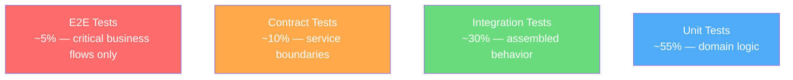

# Testing Strategy

> **Version**: 1.2.0 | **Last updated**: 2026-02-09

## Purpose

A testing strategy that produces real confidence, not cosmetic coverage. The right test at the right level, with minimum effort for maximum signal.

---

## Test Pyramid — Revisited

The classic pyramid (many unit, fewer integration, very few E2E) is a starting point, not dogma. In cloud-native applications with many services, integration and contract tests have more value than unit tests on trivial logic.



**Unit test**: for pure domain logic (entities, value objects, calculations, validations). Fast, isolated, deterministic. Not for code that's just wiring (route -> service -> repository with zero logic).

**Integration test**: for assembled system behavior (API endpoint with real database or test container, event handler with real messaging). This is where real bugs are found.

**Contract test**: for interfaces between services. The producer verifies it respects the contract, the consumer verifies it can handle the producer's responses. Pact or schema-based contracts (OpenAPI).

**E2E test**: for critical business flows (login -> create invoice -> send -> verify status). Few, slow, fragile. Only for flows that, if broken, block the business.

### Test Type Decision Matrix

| Scenario | Test Type | Why |
|----------|-----------|-----|
| Pure calculation or validation | Unit | No dependencies, fast, deterministic |
| State machine transition | Unit | Domain logic with clear inputs/outputs |
| API endpoint with DB | Integration | Tests real wiring, catches config bugs |
| Event handler with side effects | Integration | Verifies async pipeline works |
| Service-to-service interface | Contract | Prevents integration breakage at deploy |
| Login -> Purchase -> Confirm flow | E2E | Critical business path, high blast radius |
| UI component rendering | Component (unit) | Tests user-visible behavior |
| Route wiring without logic | Skip or integration | Don't unit test plumbing |

---

## Coverage Rules

**Branch coverage > line coverage.** 100% line coverage with 0% branch coverage means you tested the happy path and ignored all errors.

**Targets**: 80% branch coverage on domain layer, 70% on application layer, 50% on infra layer (tested more through integration than unit). Global target: 70%.

**Zero coverage acceptable on**: generated code, configuration, trivial glue code, pure TypeScript types.

**Coverage as signal, not goal.** If you have 90% coverage and bugs still pass, the tests are wrong (testing implementation, not behavior). If you have 60% and no bugs pass, maybe 60% is sufficient.

### Coverage Regression Detection

Coverage must not drop by more than 2% from the main branch baseline. CI enforces this:

```yaml
# In CI pipeline
- name: Check coverage regression
  run: |
    MAIN_COVERAGE=$(cat coverage-baseline.json | jq '.total.branches.pct')
    PR_COVERAGE=$(cat coverage/coverage-summary.json | jq '.total.branches.pct')
    DIFF=$(echo "$PR_COVERAGE - $MAIN_COVERAGE" | bc)
    if (( $(echo "$DIFF < -2" | bc -l) )); then
      echo "FAIL: Coverage dropped by ${DIFF}% (threshold: -2%)"
      exit 1
    fi
```

---

## Test Naming Convention

Tests describe behavior, not implementation:

```
should_<expected result>_when_<condition>
```

Examples:
- `should_reject_negative_amount_when_creating_invoice`
- `should_return_403_when_accessing_other_tenant_data`
- `should_send_notification_when_invoice_is_overdue`

In Vitest/Jest:
```typescript
describe('InvoiceCreation', () => {
  it('rejects negative amounts', () => { ... });
  it('assigns draft status to new invoices', () => { ... });
  it('requires tenant context', () => { ... });
});
```

---

## What to Test (priority order)

Business rules (domain invariants, calculations, state machines), error handling (what happens when DB is down, input is invalid, tenant doesn't exist), security boundaries (authentication, authorization, tenant isolation), integrations (external APIs, database, messaging), critical UI flows (E2E only for business-critical flows).

---

## What NOT to Test

Getters/setters without logic. Framework code (React render, Express routing). Internal implementation (call order, private variables). Mock on mock on mock (if the test has more mocks than assertions, it's testing the mock framework, not the code).

---

## Test-First vs Test-After

| Approach | When to Use |
|----------|-------------|
| Test-first (TDD) | Complex domain logic, state machines, algorithms — where the test defines the expected behavior before implementation |
| Test-after | CRUD operations, wiring code, exploratory prototyping — where the implementation is straightforward |
| Spike then test | Unknown territory — prototype without tests, then rewrite with tests once the approach is clear |

Rule: test-first is the default for domain logic. Test-after is acceptable for infrastructure wiring. No tests is never acceptable for production code.

---

## Flaky Test Policy

A flaky test (passes/fails non-deterministically) is a broken test.

**Process**: detect flaky test (CI reports intermittent failure) -> quarantine immediately (move to separate suite, exclude from blocking gate) -> create ticket with P2 priority -> fix or delete within 1 sprint.

**Quarantine rules**: quarantined tests run in a separate non-blocking CI job. Quarantined tests count as tech debt. More than 5 quarantined tests triggers a team discussion. A test quarantined for > 2 sprints is deleted.

**Common causes**: time-dependent logic, shared state between tests, race conditions in async code, external service dependencies. Fix the root cause, not the symptom (don't add `sleep()`).

---

## Mutation Testing

Mutation testing verifies that your tests actually catch bugs by introducing small code changes (mutations) and checking if tests fail.

**Tool**: Stryker Mutator for TypeScript.

```bash
# Install and run Stryker
npx stryker init  # generates stryker.config.json
npx stryker run
```

**Mutation score** = killed mutants / total mutants. Target: > 70% on domain logic. Run mutation testing on domain layer only (not infrastructure or UI) — too slow for full codebase.

Use mutation testing to find: tests that always pass regardless of code changes, missing edge case coverage, assertions that are too weak (`toBeTruthy()` instead of specific value checks).

---

## Accessibility Testing

Automated accessibility checks catch ~30% of issues. Integrate in CI:

```typescript
// In Playwright E2E tests
import AxeBuilder from '@axe-core/playwright';

test('invoice page is accessible', async ({ page }) => {
  await page.goto('/invoices');
  const results = await new AxeBuilder({ page }).analyze();
  expect(results.violations).toEqual([]);
});
```

Run axe-core in CI on every page/component. Manual testing still needed for: keyboard navigation flows, screen reader experience, focus management.

---

## Visual Regression Testing

Catch unintended UI changes by comparing screenshots:

**Tools**: Playwright visual comparisons, Percy, Chromatic (for Storybook).

```typescript
// Playwright visual comparison
test('invoice form matches baseline', async ({ page }) => {
  await page.goto('/invoices/new');
  await expect(page).toHaveScreenshot('invoice-form.png', { maxDiffPixelRatio: 0.01 });
});
```

Run on: component library changes, CSS refactors, dependency updates affecting UI. Not on every PR (too noisy) — trigger on relevant path changes.

---

## Tests as Documentation

Every test suite has a name describing behavior, not implementation. `describe('InvoiceCreation')` with `it('rejects negative amounts')`, not `describe('createInvoice function')` with `it('calls repository.save')`.

---

## Anti-Patterns

- **Testing implementation, not behavior**: tests that break when you refactor without changing behavior are coupling to implementation
- **100% coverage theater**: high coverage with meaningless tests (testing getters, testing mocks) provides false confidence
- **Test pyramid inversion**: many E2E tests, few unit tests — slow feedback, fragile suite, expensive to maintain
- **Shared mutable state**: tests depend on execution order or modify shared data — every test must be independent
- **Mocking everything**: if a test has 5 mocks and 1 assertion, you're testing the mock framework
- **No error path tests**: testing only the happy path catches only trivial bugs
- **Flaky tests ignored**: "it sometimes fails" means "it's broken" — quarantine and fix

---

## For Claude Code

When generating tests: domain tests with pure input/output (no mocks when possible), integration tests with real database (in-memory or test container), error case tests (not just happy path), descriptive behavior names. Do not generate tests that verify internal implementation. Follow the naming convention: `should_<expected>_when_<condition>`.

---

*Internal references*: `testing-implementation/SKILL.md`, `performance-testing/SKILL.md`, `security-testing/SKILL.md`
